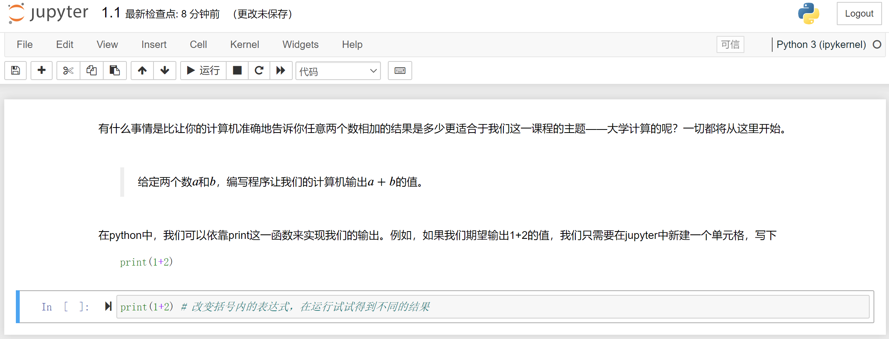

# 语言基础

在第一部分关于Python的全部教学活动中，我们强烈建议你直接进入到jupyter环境，然后参照运行。我们还十分鼓励你探索其他的内容，例如各类函数的用法、第三方库和代码风格。此外，对于绝大多数内容，我们没有事无巨细地向读者介绍全部的用法(否则这本书就应该改名叫《Python用法大全》了)。在遇到困难时，我们推荐你使用Python提供的交互式编程工具。例如

```python
Python 3.6.9 (default, Mar 15 2022, 13:55:28)
[GCC 8.4.0] on linux
Type "help", "copyright", "credits" or "license" for more information.
>>>help(print)
```

会展现`print`的全部用法和参数。此外，我们还鼓励读者使用jupyter环境进行大胆的尝试，或许就能发现Python更有趣的特性。

### 1.1 数的运算

本节对应1.1.ipynb文件。我们将在这里利用编程解决我们认识到的两个最基本的问题，并从中引出运算所构成的要件，然后逐一介绍它们。

#### 1.1.1 A+B Problem

有什么事情是比让你的计算机准确地告诉你任意两个数相加的结果是多少更适合于我们这一课程的主题——大学计算的呢？一切都将从这里开始。

> 🍈给定两个整数$a$和$b$，编写程序让我们的计算机输出$a+b$的值。

在python中，我们可以依靠`print`这一函数来实现我们的输出。例如，如果我们期望输出1+2的值，我们只需要在jupyter中新建一个单元格，写下

```python
print(1+2)
```



然后点击运行，Python就会自动输出我们期望的结果。

然而，我们不能期望于我们总是这么写。首先，我们不能确保我们总是需要输出1+2的值，我们写出的代码应该是对某一类问题（例如100以内的加法）通用的，而不能只能计算1+2；其次，在面对复杂的物理学问题时，我们直接输出数字表达式会让阅读代码的其他人难以理解这一段代码究竟在完成什么样的工作、有什么样的意义。例如下面的问题。

#### 1.1.2 自由落体

> 🍈某物体从离地高度为$h$的位置自由掉落，地球重力加速度为$g$，求落地时的速度大小$v$。

为了解决这个问题，我们联系物理学中的知识，知道在落地瞬间，物理的速度大小为

$$
v=\sqrt{2 g h}
$$

然而在不同的地区重力加速度$g$是不同的。因此我们不能直接在print时写定g=9.8；相反，我们建议使用**变量**g来代替重力加速的的值，从而我们在print()的括号中就能写出统一的数学表达式。例如，

```python
h = 1
g = 9.8
print((2*g*h)**0.5)
```

这段代码描述了当$h=1$，$g=9.8$时落地瞬间物体的速度大小。这里我们有一个略微奇怪的写法，`(2*g*h)**0.5`，其中两个星号表示的是数学中的乘方运算。当我们需要改动时，只需要改变变量`h`和`g`等号之后的数字就可以了。

从上面的两个案例，我们不难看出构成计算的一些要件：运算的对象（变量）、运算的关系（表达式和运算符）、运算结果（以何种结构的数据保存，并如何展现）。接下来我们将一一介绍这些内容。

### 1.2 运算符

本节对应1.2.ipynb文件。运算符是编程语言中承担“运算”功能的符号。

#### 1.2.1 算数运算符

一些常见的数学运算可以通过算术运算符来完成。其具体的用法如下表所示。

| 算数运算符 | 名称 | 用法(a、b为变量) |
| ----- | -- | ---------- |
| +     | 加  | a + b      |
| -     | 减  | a - b      |
| \*    | 乘  | a \* b     |
| \*\*  | 乘方 | a \*\* b   |
| /     | 除  | a / b      |
| //    | 整除 | a // b     |
| %     | 取余 | a % b      |

#### 1.2.2 位运算符

介绍位运算符以前，我们需要简单介绍整数数字在计算机中的存储模式。首先，数字被转换为只包含0和1的二进制数字，然后采用补码的方式进行存储：对于零和正数，其补码就是它本身；对于负数，其补码就是它的相反数的反码加一。反码是指对于是0的位，将其变为1；对于是1的位，将其变为0。这一点我们还将在《计算机系统》或《计算机原理与设计》等课程中进一步学习。

| 位运算符 | 名称   | 功能                                  | 实例(a = 3, b = 4用4位表示为a = 0011, b = 0100) |
| -- | ---- | ----------------------------------- | -------------------------------------- |
| &  | 按位与  | 两个数对应的二进制某一位同时为1时才为1，其余情况为0         | (`a&b`)返回0                               |
| |   | 按位或  | 两个数对应的二进制某一位只要有1时即为1，其余情况为0         | (`a|b`)返回5                                |
| ~  | 按位取反 | 对某个数对应的二进制的每一位都取反                   | `~a`返回-4                                 |
| ^  | 按位异或 | 两个数对应的二进制某一位必须是一个为0、一个为1，才为1；其余情况为0 | (`a^b`)返回7                               |
| << | 左移   | 某个数的二进制向左移若干位，最高位丢弃\*               | `a<<1`返回6                                |
| >> | 右移   | 某个数二进制向右移若干位，最低位丢弃\*\*              | `b>>1`返回2                                |

\*注：在Python3中，整数类型的位数一般认为没有上限，即从理论上讲，可以有`a<<x`，其中x可以足够大。而在一些语言(例如C语言)中，无符号整数的位数一般最高为64位，即对于`a<<x`，当x达到一定程度时就会出现预期之外的结果。

\*\*注：根据有符号整数在计算机中的存储方式可以得知，负数的最高位一定是1，因此负数右移的时候会在高位补1；零和正数右移会在最高位补0。这两条注释读者都可以拿起笔和纸模拟一个八位计算机对整数的处理来加以理解体会。

#### 1.2.3 赋值运算符

语句`a = 1`中的等号即是赋值运算符，它的功能是把等号右侧的内容赋予等号左侧。此外，我们还可以在等号左侧加上位运算符或算术运算符，表示进行了相应的位运算或算术运算之后的结果。例如

```python
x += 1 # 表示将x+1的值赋给x
x <<= 1 # 表示x左移一位之后的结果赋给x
```

#### 1.2.4 逻辑运算符

Python中存在**布尔类型**的概念。例如，下面的变量var1的值就是True，而var2的值就是False。

```python
var1 = True
var2 = False
```

有意思的是，对于一个变量，只要它的值不为零或空，那么其对应的布尔值就都是True。例如，下面的一些变量的布尔值为False。

```python
# print(bool(a)) 可以查看变量a转换为布尔类型后的值
var1 = 0
print(bool(var1))
var2 = ""
print(bool(var2))
var3 = []
print(bool(var3))
var4 = {}
print(bool(var4))
var5 = ()
print(bool(var5))

```

而下面一些变量的布尔值为True。

```python
var6 = 123
print(bool(var6))
var7 = "Undergraduate Computing"
print(bool(var7))
var8 = [1, 2, 3]
print(bool(var8))
var9 = ("word1", "word2", "word3")
print(bool(var9))
var10 = {"key1":"value1"}
print(bool(var10))

```

逻辑运算符包括or、and和not，对于变量a和b，其运算关系如下表所示。

| a     | b     | or结果  | and结果 | not结果 |
| ----- | ----- | ----- | ----- | ----- |
| True  | True  | True  | True  |       |
| False | True  | True  | False |       |
| True  | False | True  | False |       |
| False | False | False | False |       |
| True  |       |       |       | False |
| False |       |       |       | True  |

逻辑运算符的功能就是表示某个变量的布尔值，或判断两个变量布尔值之间的关系。例如，

```python
var1 = True
var2 = False
print(var1 and var2)
print(var1 or var2)
print(not var1)
print(not var2)
```

#### 1.2.5 比较运算符

既然是数字，那就一定能作比较。再Python中，比较运算符的符号及其含义大体上是符合我们已有的经验的。下面的表格给出了相应的符号。

| 运算符 | 名称 | 运算符 | 名称  |
| --- | -- | --- | --- |
| ==  | 等于 | !=  | 不等于 |
| >   | 大于 | >=  | 大等于 |
| <   | 小于 | <=  | 小等于 |

注意，Python中的符号都是半角符号，因此当我们使用中文输入法输入中文的全角符号(例如！和中文的括号)时，解释器就会提示错误。

### 1.3 变量

本节对应1.3.ipynb文件。我们用变量掩盖了数值的细节；换句话说，变量为我们提供了能够在不改变运算表达式的基础上对不同的数值进行计算的方式。在这里我们主要介绍Python支持的几种简单的变量。值得注意的是，在Python中使用变量时，无需像C语言一般先声明这个变量。通过我们之前的案例，我们可以放心地随时随地写下形如`var = 123`这样的语句，也可以随时随地地改变某个变量的类型，例如

```python
var = 123
var = "abc"
```

就将变量`var`从一个数变成了一个字符串。

#### 1.3.1 变量的命名

在Python中，如何对一个变量进行命名？一般而言，Python的解释器规定：变量名必须以字母或下划线开头，且只能包含字母、数字和下划线(A-z、0-9 和 \_)；同时，变量名是大小写敏感的，这意味着var、Var和VAR是三个不同的变量。

但是，Python具有强大的开放性。例如，我们甚至可以使用Python内置的某些关键字作为我们的变量名，例如，我们甚至可以将某个变量命名为print！

```python
print = 123
```

但问题在于，这样之后我们就无法再使用print这个函数来打印我们想打印的内容了。例如下面这段代码就无法正常运行。

```python
print = 123
print(print)
```

事实上，我们甚至可以用中文来为某个变量命名，例如

```python
变量 = 123
print(变量)
```

实际工程上，我们会遇到非常多的变量，并且它们常常具有特定的数学或物理含义。因此，我们可以直接用这些含义来作为变量的名称。例如，在1.1.2节中，我们就使用了变量名`g`来表示重力加速度。

当我们的变量具有的含义非常长时，不可避免地，我们需要使用好几个单词来描述它。因此，变量名命名的关键在于将不同的单词区分开来。一般而言，我们有两种命名实践。第一种方法即在用单词表示变量的相关含义时，单词的首字母大写以区分新单词的开始。大写的单词与小写的单词高高低低，因而前两种方法被形象地称为驼峰命名法：第一个单词的首字母小写，之后每个单词的首字母都大写，被称为“小驼峰命名法”；若第一个单词的首字母也是大写，则被称为“大驼峰命名法”。第二种叫“下划线命名法”，即用下划线区分不同的单词。

```python
littleCamelCase = 123
GreatCamelCase = "123"
under_score_case = [1, 2, 3]
```

#### 1.3.2 有关Python变量的几个特性

我们在1.3节一开始说过，Python中的变量不需要声明，且随时可以改变变量值的类型。此外，Python中的变量还有一些其他的特性。

变量实际上是一个抽象的概念，我们使用变量名这个符号来代替它指向某个内存中的地址。在Python中，我们可以使用内置函数id()来查看某个变量指向的内存地址。

```python
var = 1
print(id(var))
```

有意思的是，对于一些简单的变量的值，Python会将它们都指向同一片内存地址；尽管它们本来就是两个不同的变量，但它们可能会具有完全相同的地址。

```python
var_a = 42
var_b = 42
print(id(var_a))
print(id(var_b))
```

这里我们可以引入一种新的运算符——身份运算符。对于两个变量来说，如果它们指向同一个内存地址，那么使用身份运算符`is`后会返回True。

```python
var_a = 42
var_b = 42
var_c = 43
print(var_a is var_b)
print(var_a is not var_3)
```

事实上，如果我们将`var_a`和`var_b`的值都写成大于256的值，那么`print(var_a is var_b)`就会返回False。因此，变量的值相同，其指向的内存地址也可能不同。注意，对一个变量重新赋值后，变量指向的地址可能改变。

```python
var_x = 1
print(id(var_x))
var_x = 2
print(id(var_x))
```

当我们有很多变量时，我们也可以一次性为多个变量赋值，例如

```python
var1, var2, var3 = 1, 2, 3
```

### 1.4 数

在一些语言中，“数”这个变量类型可能还会细分；但是，在Python中，“数”可以被简单地理解成实数。在这里我们也不进一步关心，这个数到底是一个什么样的类型。我们只需要知道，这是我们日常生活中无时无刻不用到的“数”就可以了。也就是说，你可以对为任何一个变量赋予一个实数的值。例如，

```python
var1 = 2.71828
print(var)

```

尤其是Python3对大整数的支持，使得我们不用去担心计算一个超级大的整数可能会带来的错误。例如，可以使用Python计算2的128次方。

```python
var = 2**128
print(var)
```

当然，一些神奇的现象也会经常发生。例如，

```python
print(0.6*3)
```

出人意料的是，打印出的结果是1.7999999999999998；然而我们希望的结果是1.8。试想，如果无法保证结果是精确的，我们显然不放心把大量的数据都交给计算机来做运算；况且0.6×3是一个相当简单的小学算术。这让我们是难以接受的。我们在这一章的末尾给出了这样情况发生的确切原因，当然，现在我们先用一个我们目前能够接受的解决方案规避这个问题。

```python
print(round(0.6*3, 2))
```

函数`round()`接受两个参数。第一个参数是某个数，第二个参数是我们期望保留的小数位数。这个参数会返回四舍五入之后的值，然后我们将其打印了出来。在之后的练习中，我们还会遇到这些超乎预期的问题；但它们并不是你的计算机或者Python出现了错误，而是我们的计算机在设计之初遵循的某些原理造成了这些缺陷。这些内容我们将在《计算机系统》这门课程中有深入的了解。

### 1.5 列表

把许多数放在一起，就组成了数组。在Python中，存在一种数据类型叫列表；列表中不仅能够存放数，还能存放其他的数据。列表的类型表示为`list`。像下面所示的一样，我们可以简单地初始化一个空列表。

```python
array_a = []
```

#### 1.5.1 添加元素

好了，现在我们可以向列表内添加任何我们希望的元素，例如

```python
array_a.append(42)
```

注意到，这一条语句并不是赋值语句。这是因为在Python中，一些操作是不包含返回内容的，因此我们也无法将这个操作赋值给某个变量。在之后我们还会遇到更多的操作，它们都具有类似的性质。

现在`array_a`中就已经有1个元素了，我们可以简单验证一下。

```python
print(array_a) # 这条语句可以打印列表中的全部元素
print(len(array_a)) # len()函数可以返回列表的元素个数
```

我们还可以通过下标来访问列表中的元素。我们可以这样来理解“下标”，即我们将列表抽象为一般形式，即对于一个包含n个元素的列表，它当中的元素都形如

$$
[a_0, a_1, a_2, ..., a_{n-1}]
$$

那么下标的含义和数学上的数列元素的下标保持一致了。

在Python中，下标是从0开始的，这意味着`array_a`中的第1个元素的下标为0，以此类推，最后一个元素的下标为`len(array_a) - 1`。这与我们日常生活中的体验是不同的。当然，我们也可以反向索引，此时列表中的最后一个元素的下标是-1，以此类推，第一个元素的下标为`-1*len(array_a)`。需要注意的是，这两种表示方式是完全等价的，你只需要选用自己喜欢的一种就可以。

```python
array_a = [1, 4, 2, 5, 33, 'a', "aristo", 76]
print(array_a[0])
print(array_a[1])
print(array_a[-1])
print(array_a[-1*len(array_a)])
```

如果我们希望在特定的位置添加元素，那么我们可以使用`insert()`方法，并且需要指定我们添加的位置的具体下标情况。例如`array_a.insert(6, 42)`表示将42插入列表`array_a`中，并且42的下标将会是6；其余元素的下标保持不变或依次向后挪动1。

#### 1.5.2 列表的嵌套

列表是可以嵌套的。这意味着列表内可以包含另一个列表。此时，我们通过索引来访问时，也相应地需要两个值来进行索引，就像二维平面坐标轴上的点需要使用两个量(x, y)来唯一确定一样。

```python
array_b = [1, 2, [3, 4, 5]]
```

例如在上面的列表中，由于列表`[3, 4, 5]`被嵌套在了`array_b`中，如果我们想得到元素3，那么我们就必须使用两个值来访问，例如

```python
print(array_b[2][0])
```

这个语句的含义是在`array_b`中第3个第一级元素中的第1个元素。在这个过程中，我们是将`[3, 4, 5]`整体看作了`array_b`中的一个元素。当然，如果我们想得到元素1，我们就不必使用两个值来访问，只需要

```python
print(array_b[0])
```

#### 1.5.3 列表元素的删除

一般而言，有三种方式可以实现对列表元素的删除。

我们可以用`pop()`的方法依靠索引值删除元素。例如

```python
array = [1, 5, 3, 3, 2, 6, 4, 7]
array.pop(5) # 表示删除下标为5的元素，即删除数字6
print(array)
array.pop() # 当不指定参数时，默认删除最后一个元素
print(array)
```

我们也可以使用`remove()`方法，依靠元素的值删除元素。例如

```python
array = ["iaa", "ga", "ctk", "ga", "aba", "da-6"]
array.remove("iaa") # 删除值为"iaa"的元素
print(array)
array.remove("ga")
print(array)
```

从上面的示例中我们应该不难发现，当有多个元素的值满足要求时，只会删除满足要求的下标最小的元素。

我们还可以使用`del`关键字来删除列表元素。例如

```python
array = ["iaa", "ga", "ctk", "ga", "aba", "da-6"]
del array[0] # 删除第1个元素
print(array)
```

同时也可以删除整个列表。

```python
array = ["iaa", "ga", "ctk", "ga", "aba", "da-6"]
del array
```

有时候为了清空列表的元素，我们可以使用`clear()`方法。

```python
array = ["iaa", "ga", "ctk", "ga", "aba", "da-6"]
array.clear()
print(array)
```

#### 1.5.4 查找元素

通过`index()`方法，我们可以得到我们所查找的值的元素的下标。如果有多个元素满足，则返回的是最小的下标。

```python
array = [1, 4, 3, 4, 5, 6, 9]
result = array.index(4)
print(result)
```

同时，如果我们想了解某个列表中某个元素到底出现了多少次，我们可以使用`count()`方法。例如

```python
array = [5, 9, 5, 7, 2, 3, 2, 6, 1, 3, 8, 4, 
         8, 8, 1, 1, 7, 4, 0, 0, 5, 3, 7, 7, 
         0, 9, 7, 7, 3, 0, 7, 3, 0, 4, 9, 7]
result = array.count(5)
print(result)
```

#### 1.5.5 顺序关系

我们使用`reverse()`方法，将列表中的元素顺序进行反转。

```python
array = [1, 3, 5, 2, 4]
array.reverse()
print(array)
```

还可以使用`sort()`方法对列表元素进行排序。

```python
array = [5, 3, 4, 2, 1]
array.sort()
print(array)
```

如果我们希望在排序的同时，我们还能保留之前的列表顺序，一般来说可以采用以下两种方法：一是使用内置函数`sorted()`，这个函数存在返回值，返回值即是排列好顺序的列表；二是在排序前，可以先把列表复制一份，这时我们需要用到`copy()`方法。值得注意的是，如果我们直接使用`list2 = list1`来企图复制一个列表，那么在`list2`的内容改变后，`list1`的内容也会相应改变，并不能起到复制列表的作用。

```python
# 方法一
list1 = [1, 5, 5, 3, 7]
list2 = sorted(list1)
print(list2)
# 方法二
list3 = [1, 5, 5, 3, 7]
list4 = list3.copy()
list4.sort()
print(list4)
```

#### 1.5.6 列表的切片

有时候我们希望只取出列表中的一部分数，那么列表切片就是非常重要的手段了。其基本的方法是：

```python
array_b = array_a[start: end: step]

```

在Python中，一般表示区间的时候都是左闭右开区间。例如，此处的`start`和`end`分别指开始处和结尾处的下标，但并不包含`end`这个下标。如果我们希望把某个元素及其之后的全部元素都包含进来，那么end可以省略，成为如下的格式。

```python
array_b = array_a[start::step]
```

`step`表示取元素的间隔。如果是从前往后索引（即start\<end），则step>0；我们也可以从后往前索引，设置start>end的时候，使step<0即可。当step省略时，默认为1。下面给我们给出几个案例供读者思考和体会。

```python
array = [1, 2, 3, 4, 5, 6, 7, 8, 9, 0]
array_b = array_a[0:3]
print(array_b)
array_b = array_a[0:6:2]
print(array_b)
array_b = array_a[0:]
print(array_b)
array_b = array_a[0::2]
print(array_b)
array_b = array_a[-1::-1]
print(array_b)


```

元组和集合是Python中另外两种十分重要的数据结构。它们有许多用法和列表是类似的，读者可以通过查阅官方手册进行了解。

### 1.6 字符串

在之前的实践中，我们大致能够体会到字符串是一个什么样的数据类型，形式上，字符串变量就是用双引号将某些内容引住。双引号和单引号是等价的。例如

```python
string = "Stay hungry; stay foolish."
print(string)
```

如果希望将字符串写在多行，可以用三个引号。例如

```python
string = """Four score and seven years ago, 
our fathers brought forth on this continent, 
a new nation, conceived in Liberty, 
and dedicated to the proposition that all men are created equal."""
print(string)
```

字符串很多特性都和列表相同，并且可以通过下标来访问字符串中的每个字母；同时，字符串的切片和列表是完全一致的。当然，字符串也有一些独特的操作方法。

#### 1.6.1 对单词的操作

*   `upper()`和`lower()`方法分别能够返回大写或小写的字符串。

```python
string = "hello"
string_upper = string.upper()
print(string_upper)
string_lower = string.lower()
print(string_lower)
```

*   `replace`方法能够批量对指定的文本进行替换。第一个参数是要被替换的文本，第二个参数是用其替换的文本。

```python
string = "hello hello hello"
string_replaced = string.replace("hello", "goodby")
print(string_replaced)
```

*   `strip()`方法用于将字符串开头和结尾的空格和转义字符清除。至于转义字符我们将在之后介绍。

```python
string = "   hello\t\n"
string_s = string.strip()
print(string_s)
```

*   我们还可以通过特定的分隔符将字符串分割成若干小的字符串，该功能使用`split()`方法实现。如果不给定任何参数，则是以空格分隔。

```python
s = "hello world"
slist = s.split()
print(slist)
slist = s.split('o')
print(slist)
```

#### 1.6.2 字符串的输出

一般而言，我们在程序设计时为了让输出更友好，会人为地添加一些辅助内容，帮助用户更好理解。至少从用户的角度出发，用户显然很难接受一个不知道具有什么含义的数值。因此，我们使用一些特定的方法将字符串与我们得到的结果一起输出。

> 🍈假设某物体做匀变速直线运动，初速度为0，加速度为1$\mathrm {m/s}$。求经过$t$秒后的速度。

根据运动学公式，我们不难写出$t$秒后物体的速度为

$$
v = \frac{1}{2}at^2
$$

因此根据我们已知的事物，我们不难写出下面的代码来求解问题。其中第一行表示我们的程序接受来自用户的输入，即用户可以输入一个小数，其含义是经过的时间$t$。

```python
t = float(input())
a = 1
v = 0.5*a*t**2

```

现在的问题在于我们如何将我们的各项数据“连词成句”，并以相对用户友好的方式进行输出。

方法一，我们可以直接使用print()，将各个内容连接在一起。在这种情况下，每个输出的元素之间会自动添加上空格。

```python
print("After", t, "seconds, the velocity reaches", v, "m/s.")
```

方法二，我们介绍printf风格的字符串的标准化输出。

```python
print("After %f seconds, the velocity reaches %f m/s." % (t, v))
```

这也是一种常用的输出方法。占位符`%f`标志着我们将输出一个浮点数(小数)，通过形如上方的代码，输出是会自动匹配我们之后给定的参数。其他的用法可以参阅下方表格。

| 占位符  | 说明             |
| ---- | -------------- |
| %s   | 字符串            |
| %d   | 整数             |
| %f   | 小数(至多六位)       |
| %.xf | x是数字，表示输出x位的小数 |
| %e   | 科学计数法(底数为10)   |
| %%   | 百分号本身          |

方法三，我们介绍format格式化输出方法。例如下面的语句可以将变量`gpa`插入到text中。

```python
gpa = 4.0
text = "My GPA of UC course is {}."
print(text.format(gpa))
```

对于给定的多个参数，可以按照顺序组织，也可以按照关键词组织。例如

```python
t = float(input())
a = 1
v = 0.5*a*t**2
text = "After {} seconds, the velocity reaches {} m/s."
print(text.format(t, v))
```

或者

```python
t = float(input())
a = 1
v = 0.5*a*t**2
text = "After {time} seconds, the velocity reaches {velocity} m/s."
print(text.format(time=t, velocity=v))
```

字符串的更多方法，可以通过在交互式编程界面中输入`dir(str)`查看。

```python
>>> dir(str)
['__add__', '__class__', '__contains__', '__delattr__', '__dir__', '__doc__', '__eq__', '__format__', '__ge__', '__getattribute__', '__getitem__', '__getnewargs__', '__gt__', '__hash__', '__init__', '__init_subclass__', '__iter__', '__le__', '__len__', '__lt__', '__mod__', '__mul__', '__ne__', '__new__', '__reduce__', '__reduce_ex__', '__repr__', '__rmod__', '__rmul__', '__setattr__', '__sizeof__', '__str__', '__subclasshook__', 'capitalize', 'casefold', 'center', 'count', 'encode', 'endswith', 'expandtabs', 'find', 'format', 'format_map', 'index', 'isalnum', 'isalpha', 'isascii', 'isdecimal', 'isdigit', 'isidentifier', 'islower', 'isnumeric', 'isprintable', 'isspace', 'istitle', 'isupper', 'join', 'ljust', 'lower', 'lstrip', 'maketrans', 'partition', 'replace', 'rfind', 'rindex', 'rjust', 'rpartition', 'rsplit', 'rstrip', 'split', 'splitlines', 'startswith', 'strip', 'swapcase', 'title', 'translate', 'upper', 'zfill']
>>> help(str.find)
Help on method_descriptor:

find(...)
    S.find(sub[, start[, end]]) -> int
    
    Return the lowest index in S where substring sub is found,
    such that sub is contained within S[start:end].  Optional
    arguments start and end are interpreted as in slice notation.
    
    Return -1 on failure.
```

### 1.7 字典

在Python中，字典是一种特别的数据类型。我们知道，访问列表的元素需要通过下标来访问。假设我们已知某学生的姓名与成绩，如何设计一个方案，做到这两者的一一对应地存储？

或许我们可以维护两个列表。第一个列表存储学生的姓名，第二个列表存储学生的成绩。类似下面这样。

```python
names = ["Abner", "Andrew", "Gpmelon"]
scores = [100, 90, 80]

```

注意到，我们可以通过下标将两个列表联系在一起。也就是说，`names[i]`对应的学生的成绩就是`scores[i]`。这样，我们就通过下标这个中介完成了两个列表的联系。在实际问题中，下标可能还具有现实意义，例如可以是学生的编号。

而列表则是将下标直接抽象成为了其中一个列表的某种元素，我们称之为“键”；而键所对应的信息就是“值”。例如，在上面的案例中，`"Abner"`就是键，而其对应的分数`100`就是值。现在，我们来创建一个字典，实现刚刚用两个列表才能完成的功能。

#### 1.7.1 字典的基本操作

字典的创建非常简单，与创建一个列表类似，我们只需要用空的花括号表示即可。

```python
dic = {}
```

要向字典内添加元素也很容易，只需要遵循`字典名[键] = 值`就可以了。现在我们将学生的姓名和成绩都添加进去。

```python
dic["Abner"] = 100
dic["Andrew"] = 90
dic["Gpmelon"] = 80
```

当我们希望访问`"Abner"`对应的值时，只需要

```python
print(dic["Abner"])
```

在创建字典时，我们就能首先赋予字典一些初始元素。例如，

```python
dic_g = {"key0": "value0", "key1": "value1"}
```

字典从某种意义上来看是与数据库有些相似的。数据库的基本功能是增、删、改、查，字典同样也支持这些功能。

删除字典内的元素，与删除列表中某个元素类似，只需要

```python
dic.pop("Andrew")
print(dic)
```

注意，字典的键是不能够重复的（就像每个人的学号是能够确认你成绩的标识，显然不能重复），当我们试图为一个有某个键-值对的字典元素再次赋值时，改键对应的值会被更新。例如，

```python
dic["Gpmelon"] = 90
print(dic)
```

### 1.8 程序的结构

按照结构化程序设计方法，程序都由顺序结构、分支结构和循环结构构成。顺序结构，我们在上面的过程中应该有所感悟，简而言之，就是计算机在执行语句时都是一条一条按照顺序来执行的；这不仅是计算机的工作方式，也是符合我们人类思维的习惯。

#### 1.8.1 分支结构

> 🍈神经网络中，ReLU函数是重要的激活函数；其表达式为$relu(x)=max\left \{0, x  \right \}$。

显然，我们可以将其改造为我们熟悉的分段函数

$$
relu(x)=\left\{\begin{matrix}0, x\le 0
 \\x, x > 0
\end{matrix}\right.
$$

那么在实现它的过程中，我们期望能够通过某种语句，在条件满足时执行某部分，条件不满足时则调换到另外一部分语句执行。这个语句就是`if (else)`语句，例如

```python
if (满足的条件):
  执行的语句a1
  执行的语句a2
else:
  执行的语句b

```

表示在满足条件时，执行语句a1、a2，否则执行语句b。如果无需说明其余情况，else可以省略。在这里我们需要注意的是语句a和语句b都分别有了缩进，即它们开始书写的位置与`if`相比都有了若干空格。这是十分重要的，Python正是通过这些空格来确定语句块的位置，即通过相同的缩进，解释器能够认定a1和a2都是在满足条件时才执行的。至于缩进的空格数则没有特别的限制，只是在同一语句块内，缩进的数目应当是相同的。

上面我们介绍的是两个分支的情况。对于多个分支，我们还可以有这样的形式。

```python
if (满足的条件1):
  执行的语句a
else if (满足的条件2):
  执行的语句b
else if (满足的条件3):
  执行的语句c
else:
  执行的语句d

```

则表示四个分支的结构。

因此，针对上面的问题，我们可以写出这样的代码。

```python
x = float(input())
if (x <= 0):
  print(0)
else:
  print(x)

```

#### 1.8.2 循环结构

循环结构，顾名思义，就是将相同或相似的语句重复多次执行。一般来说，有两种方式可以实现循环结构。一是for循环，而是while循环。我们通过下面的实例来逐步认识和掌握这两种写法。

> 🍈计算$\sum_{n=1}^{100} n$的值。

我们可以用for循环来实现它。for循环的基本语法是

```python
for i in range(start, end, step):
  执行的语句块

```

其中，start、end、step所遵循的规则与1.5.6一节中列表的切片完全一致。因此，

```python
ans = 0
for i in range(1, 101):
  ans += i
print(ans)
```

此外，也可以使用while循环来实现它。while循环的基本语法是

```python
var0 = 初始值
while(var0满足某个条件):
  执行的语句块

```

例如，

```python
cnt = 1
ans = 0
while(cnt <= 100):
  ans += cnt
  cnt += 1
print(ans)
```

如果我们在语句块中忘记将变量`cnt`在每次循环时加1，那么我们的程序就永远都无法执行结束，也就是进入了死循环。在循环结构中，死循环是十分常见的错误。

循环是可以嵌套的。例如，当我们要逐个打印出一个二维数组内的元素时，就需要用到嵌套循环。注意，在嵌套的时候也要有相应层级的缩进。

```python
array = [[1, 2, 3], [4, 5, 6]]
for i in range(0, 2):
  for j in range(0, 3):
    print(array[i][j])

```

### 1.9 强制类型转换 变量的作用域建议

在之前的学习中，我们有意无意地淡化了变量类型这一概念。事实上，我们的直觉也告诉我们，“数字”和“字符串”应当是两种不同的类型。鉴于读者已经对Python程序有了大致的了解，我们现在需要介绍不同变量之间如何转换了。

现在，我们有一个整数num，它是int类型。

```python
num = 2
print(num)
```

我们需要将其通过强制类型转换到小数，即浮点型(floating-point)。

```python
fl_num = float(num)
print(fl_num)
```

我们再将其转换为字符串。

```python
str_num = str(fl_num)
print(str_num)
```

现在看来，转换的基本规则相信读者已经有了解了，则是利用强制类型转换的函数。事实上，通过将字符串转换为列表的方式，还可以实现将字符串中的每一个字符“裂开”。

读到这里，相信读者大概能够猜出为什么我们之前的代码中会有这样的片段，例如

```python
content = int(input())
```

其中，`input()`函数接受用户的输入，而用户不论输入什么，都是以字符串的方式输入的，因此如果我们希望用户输入的是一个整数，那么必须要把输入的内容转换为整数类型。

然后我们再来说说变量的作用域。变量是有一定的作用范围的，离开了这个作用范围，变量就不能起作用，这样的设定最大程度地防止了我们的代码出现歧义。对于Python而言，由于没有标志每一个语句结束的符号，因此依赖缩进来确定语句之间的关系；在这种情况下，明白变量的作用域更有利于我们写出规范和易于阅读的代码。

在Python中，下列代码是可以被接受并运行得出结果的。

```python
for i in range(0, 10):
  n = i
print(n)
```

在循环结束后，打印变量`n`的值。

Python中，定义在函数体内的变量作用域只在函数体内。在函数体外定义的变量都是全局变量，这也解释了为什么循环结束后会打印出9。虽然会打印出9，但是我们强烈不建议你这么做。在其他的一些高级语言(例如C语言)中，这种写法无法通过编译，因为在其他高级语言中，`n`通常会被视为一个局部变量。例如下面的代码无法通过gcc的编译。

```c
#include <stdio.h>
int main(){
  for (int i = 1; i < 10; i++){
    int n = i;
  }
  printf("%d", n);
  return 0;
}
```

之后，我们将从程序的状态机的视角解释为什么函数内的变量不能被函数外的语句访问。例如在下面的代码中，我们无法在调用函数以后再访问变量`in_x`的值。

```python
def relu(in_x):
    return in_x if in_x > 0 else 0

a = relu(2.3)
print(a)
print(in_x) # 解释器会提示这一行错误
```

### 1.10 模块的引入与使用

现在我们还没办法计算形如$\sin x$这样的值，我们也还没有像$\pi$和$\mathrm e$这样的常数的值。不过好消息是Python已经为我们准备好了这一切。这就需要我们从一个名叫math的模块中引入这些内容。一般来说，我们可以

```python
import math
print(math.pi)
```

此外，我们也可以

```python
from math import pi
print(pi)
```

第三种方法是

```python
from math import *
print(pi)
```

乍一看第二种和第三种引入方法都十分有利于我们使用pi。但是，我们强烈建议读者不要使用这两种方式。原因在于：一方面，可能程序中在其他地方也是用了pi作为某个变量的变量名，这样会引起冲突；另一方面，第三种方法是引入了math库中的全部内容，不仅容易与已经定义的变量名有冲突，还可能与引入的其他模块中变量的名称有冲突。例如，

```python
import math
print(dir(math))
import cmath
print(dir(cmath))

```

我们容易发现这两个库中有许多函数的名称是完全一致的。事实上，模块cmath不仅支持对实数的运算，还支持对复数的运算。Python中复数类型的变量，虚数部分使用j而不是我们在数学上熟悉的i，形如

```python
complex_num = i+4j
print(type(complex_num))
```

引入之后，我们就能直接使用相应的函数或数值了。例如，

```python
sin_x = math.sin(math.pi/2)
print(sin_x)
```

如果我们希望像之前一样参考这些函数或数值的用法，我们依然可以使用help函数，但需要注意的是，我们首先仍然需要引入这些模块。例如，

```python
import math
help(math.sin)
```

### 思考题

1\. 编写一个程序，输出"Hello, world!"

2\. 分子动理论认为，气体系统内大量分子无规则热运动导致分子之间频繁地相互碰撞，分子以大小不同的速率向各个方向运动，在频繁的碰撞过程中，分子间不断交换动量和能量，使每一分子的速度不断变化。处于平衡态的气体，每个分子瞬时速度的大小、方向都在随机地变化，但就大量分子的整体来看，在一定的条件下，气体分子的速度分布也遵从一定的统计规律，这个规律也叫麦克斯韦速率分布律。麦克斯韦速率分布公式如下：

$$
f(v)=4 \pi (\frac{m}{2 \pi k T})^{\frac{3}{2}}e^{- \frac{mv^2}{2kT}}v^2
$$

其中$m$为一个气体分子的质量，$k$为玻尔兹曼常量($1.38 \times 10^{-23}$)，$T$为系统的热力学温度，$\mathrm e$为自然对数的底。编写一个程序，对于输入的速率$v$，计算氧气分子在标准状况下对应的$f(v)$的值。

3\. 1914年，印度天才数学家斯里尼瓦瑟·拉马努金在他的论文里发表了一系列共14条圆周率的计算公式，这个公式每计算一项可以得到8位的十进制精度：

$$
\frac{1}{\pi}=\frac{2 \sqrt{2}}{9801}\sum_{k=0}^{\infty}\frac{(4k)!(1103+26390k)}{(k!)^4 396^{4k}}
$$

编写一个程序，对于输入的数据k，计算$\pi$的近似值。

4\. 编写一个程序，对于输入的字符串，将其倒序输出。

5\. 编写一个程序，判断输入的整数是否为质数，如果是则输出Yes，否则输出No。

6\. 给定三条边的长度，可以通过“三角形任意两边之和大于第三边”判断这三条边能否构成三角形。编写一个程序，输入三条边的长度，判断其是否能构成三角形，如果是则输出Yes，否则输出No。
