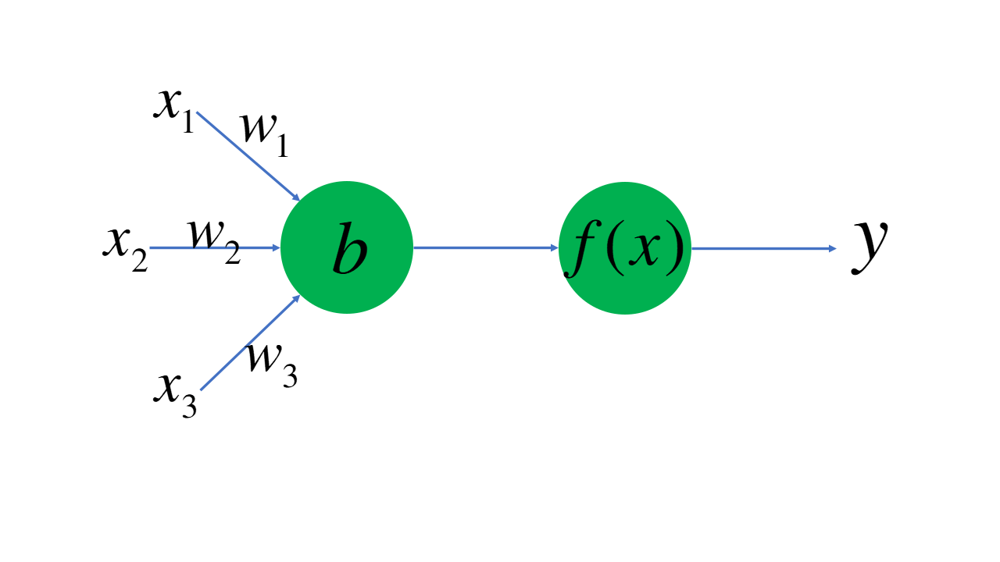
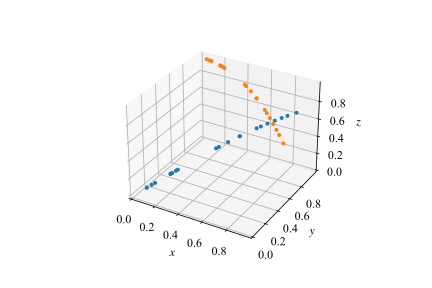
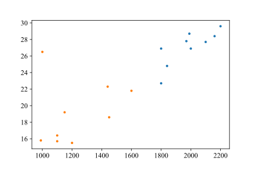
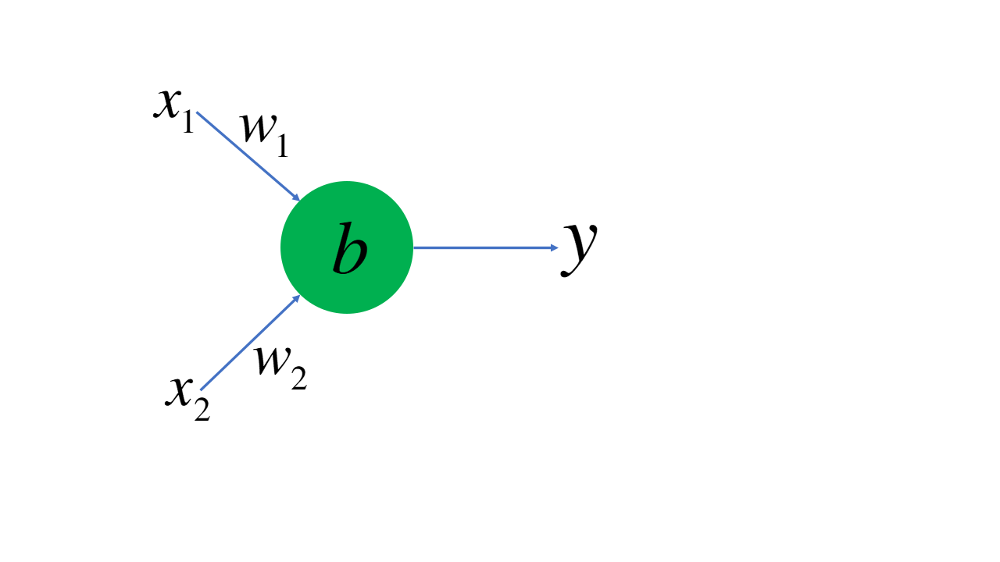

# 机器学习与人工智能概论

作为一门计算机科学的导论课，我们当然需要把计算机科学的各个分支都融合进这门课程中——显然，少不了当下十分热门，并深刻地改变了人类社会的一个分支——机器学习。现在，我们就将走进机器学习的大门。在此之前，我们有必要来速成一下有关神经网络和机器学习的内容。

用Python在机器学习领域进行“炼丹”，是再火热不过的话题了。作为一门胶水语言，Python简直可以做太多太多事情；在机器学习领域，著名的库，例如Keras，Pytorch和Tensorflow，尽管它们的后端可能使用C++进行更高效的计算，但提供的API确实Python的，这样大大减少了跨学科领域研究的难度，研究人员只需要掌握Python就能根据自己的模型进行训练——而在之前的所有学习中，你应当感受到了Python是相对容易掌握的。

### 6.1 最基本的神经元模型

在IEEE（电气和电子工程师协会，读作eye-triple-ee）网站上我们能找到J. von Neumann于1945年发表的*First draft of a report on the EDVAC*一文，在这篇文章中，J. von Neumann引入了MacCulloch和W. Pitts的神经元模型；可见人类对于神经元模型的探索是伴随着计算机被创立就开始了。这也很好理解，因为起初人们就是希望模仿人脑进行计算机的制造，而人脑神经的工作方式，自然而然就成为了研究和模仿的重点。在计算机科学的发展中，这一模型还进一步发展成为感知机，而后就是我们熟悉的机器学习与人工智能了。

下面我们展现了一个最基本的神经元模型。

这个神经元工作的方式是，接受数据的某些特征$x_1,x_2,x_3$的输入，并将其分别乘以权重（weight），再减去偏置值$b$，将得到的结果放入激活函数$f(x)$，最后得到输出$y$。激活函数是非常重要的一环，它能够将我们的输出统一起来，而不会出现某两个输出值相差特别巨大的情况。在《语言基础》一章中，我们就曾经构建过著名的激活函数ReLU。

这个神经元工作的方式是，接受数据的某些特征$x_1,x_2,x_3$的输入，并将其分别乘以权重（weight），再减去偏置值$b$，将得到的结果放入激活函数$f(x)$，最后得到输出$y$。激活函数是非常重要的一环，它能够将我们的输出统一起来，而不会出现某两个输出值相差特别巨大的情况。在《语言基础》一章中，我们就曾经构建过著名的激活函数ReLU。

如图所示，在一个三维空间中我们有若干个点，有的是橘色，有的是蓝色。假设我们通过神经元对橘色的点和蓝色的点进行分类。这两种点都具有的特征是坐标$(x,y,z)$，我们将其作为$(x_1, x_2, x_3)$输入神经元。乘以权重，减去偏置；假设我们的激活函数就是ReLU函数，再将得到的值放入激活函数，即

$$
y=\mathrm {relu}(w_1x_1+w_2x_2+w_3x_3 - b)
$$

假设我们认定$y>0$表示我们通过这个点的信息，预测这个点是蓝色；$y<0$是橘色。那么假如某个点本来是蓝色，但是带入这个点的坐标以后通过我们的计算$y<0$，那么说明我们的权重$(w_1, w_2, w_3)$和偏置$b$的选取有问题，这时候我们就需要调整参数，直到我们能够区分出绝大多数点。

这个时候，如果我们绘制出$w_1x_1+w_2x_2+w_3x_3-b=0$，即$w_1x+w_2y+w_3z-b=0$，我们事实上是得到了三维空间中的一个平面。这个平面将大多数蓝色和橙色的点分隔开。

总而言之，在这个最基本的神经网络模型中，进行机器学习的步骤就是选取特征、计算值、调整参数、得出结果。

### 6.2 两种气候

亚热带季风和湿润气候和热带雨林气候是两种不同类型的气候。这两种气候在年平均温度和维度上都有所区别。在下面我们给出的这张图片中，我们展示了一些地区的年平均温度和纬度。其中，橙色点表示的是亚热带季风和湿润气候，蓝色的点表示热带雨林气候。由于某一年气候的变化，收集到的实际气候数据如下图所示。

其中横坐标表示年降水量，纵坐标表示年平均温度。我们现在希望的是要构造一个神经元模型，能够正确区分这两种气候类型。

根据我们刚刚的经验，要把两个采集到的数据作为输入，那么我们就可以构造一个包含两个输入的神经元，如下图所示。

好了，现在我们可以随便初始化一个向量$(w_1, w_2)$，并将$b$初始化为$0$，我们可以用numpy的数组来实现这个功能，我们的线性回归方程就是$w_1x_1+w_2x_2-b=0$（也就是说，我们可以用这条直线将坐标图分为两部分），可以画出图像来。

可以看到，这离我们的预期还是有很大差别的。现在就要实现最关键的一步：实现$(w_1, w_2)$的自动调整，达到我们希望的如下图所示的这种状况。

这样，如果$w_1x_1+w_2x_2-b>0$，那么就一定是橙色部分的点，反之则是绿色部分的点。现在，我们对模型稍加改动，变成

$\mathrm{sgn}(x)$恐怕是高中数学接触的最有名的分段函数之一了，其表达式为

$$
\mathrm{sgn}(x)=\begin{cases} -1, x < 0
 \\0, x = 0
 \\ 1, x > 0
\end{cases}
$$

这样，如果我们的输出为1，则说明是热带雨林气候，反之则为亚热带季风和湿润气候。

#### 6.2.1 参数的自动调整

当我们带入某一个点的坐标我们就一定能算出某个值。现在我们希望的是刻画这个点计算出的值与正确的值之间的差距。例如，当我们带入某个点，通过这个模型得到的值是1，但根据其实际气候类型判断，我们期望的值为0，那么我们可以构造这样的函数

$$
L = y_{\mathrm{expect}}-y_{\mathrm{predict}}
$$

来描述我们“离正确结果还差多远”。我们可以通过这个函数来对$w_i$和$b$进行调整，实际上就是使我们的$w_i$加上一个小小的$\Delta w_i$，使$b$加上一个小小的$\Delta b$；$\Delta w_i$和$\Delta b$的值，显然是与$L$有关的，如果$L$较大，那么调整量也应该更大；此外，增量$w_i$也与$x_i$有关，如果$x_i$越大，说明在相同的$w_i$下，偏向某一方的值也就越大，因此还应当考虑增量与$x_i$之间的关系。你可以自行设计算法，然后进行迭代。最终我们就能得到正确的值。

### 6.3 升高维度 线性变换 激活函数

现在我们来说说升高维度。

现在我们有若干的点，如图所示。显然，我们再也没有办法将这两种点通过一条直线分开了。不过，我们稍加一点改动，对于每一个点输入的向量$(x_1, x_2)$，我们都先乘上一个矩阵再加上一个向量，即

$$
\begin{bmatrix}
w_1  & w_4\\
w_2  & w_5\\
w_3  & w_6
\end{bmatrix}\begin{bmatrix} x_1
 \\ x_2
\end{bmatrix}
+\begin{bmatrix}b_1
 \\b_2
 \\b_3
\end{bmatrix}=\begin{bmatrix}w_1x_1+w_4x_2+b_1
 \\w_2x_1+w_5x_2+b_2
 \\w_3x_1+w_6x_2+b_3
\end{bmatrix}
$$

将最右边的向量记作$(z_1, z_2, z_3)$，现在我们的点已经被转化到了三维空间。我们随便构造一个$[w_i]$和$[b_i]$的矩阵，来看看它在升高维度以后是什么样的。令$w_1=1,w_5=1$，其余参数都为零。那么图形就变成了

现在，就到了线性变换。笔者在大学一年级秋季学期上《线性代数》课时，教员一上来就讲矩阵、行列式，没有线性，更不必说代数；导致笔者学起来云里雾里。后来偶然看到*inear Algebra and Its Applications*一书，才明白原来线性代数中线性变换是多么的重要，然而在笔者大学一年级的《线性代数》课上，这些内容毫无涉及。如果你感兴趣，我们还是强烈推荐你参考一下刚刚提到的那本教材。

通过线性变换，我们能够改变这些点的排布。如果我们能够找到矩阵$[w_i]$和$[b_i]$，使得蓝色的点通过计算后，$(z_1,z_2,z_3)$中的每一个元素都小于零，而橘色的点至少保证有一个大于零，现在我们就可以搬出某个函数，不妨把我们熟悉的符号函数改造成

$$
f(x)=\begin{cases} 1, x > 0\\
0, x \le 0
\end{cases} 
$$

这样，我们对$(z_1, z_2, z_3)$中的每一个元素都加上这样一个函数，那么蓝色点对应的区域就始终是$(0, 0, 0)$，而将这个点与其他点分开就是再容易不过的事情了。这就是激活函数。除了这个阶跃函数以外，还有$\mathrm{sigmoid}$、$\mathrm{tanh}$等激活函数。

现在，我们可以以用平面来将这个点与其他点分开，也就达到了将蓝色点与橙色点分开的目的。因为我们必须使用一个面，所以我们的输出层将会包含两个神经元。

### 6.4 梯度下降

现在我们的网络结构可以用下面这张图来表示。

点与点之间还有$[w_i]$，我们也没有画出。现在我们知道，每次调整了\[w\_i]和\[b\_i]的值之后，机器分类的正确率都会有所变化。假设我们定义好某个损失函数（用于描述机器分类符合预期的函数，损失值越大，机器分类一般越不准确），那么我们可以认为损失函数就是关于$w_i$和$b_i$的一个多元函数，即

$$
Loss = f(w_1, w_2, ...,w_n, b_1, b_2, ..., b_n)
$$

和“两种气候”的分类一样，我们通过求损失函数关于$w_i$的偏导数$\frac{\partial f}{\partial w_i}$和对$b_i$的偏导数$\frac{\partial f}{\partial b_i}$，加上我们的学习率，就能确定我们在每一个参数的调整上需要调整多少。这样的方法被我们称为**反向传播**。例如，在上面的模型中，如果$f(x)$选用的是$\mathrm{sigmoid}$函数，损失函数确定为$Loss=\frac{1}{2N}(y_{\mathrm{expect}}-y_{\mathrm {predict}})^2$。现在，当我们随便设置好初始参数，输入第一个训练样本的$(x_1, x_2)$，此时$N=1$。现在来求$h_2$上方的$b_{h2}$对于损失函数的的偏导数。

根据链式法则，有

$$
\frac{\partial Loss}{\partial b_{h2}}=\frac{\partial Loss}{\partial y_{\mathrm{predict}}}\frac{\partial y_{\mathrm{predict}}}{\partial f}\frac{\partial f}{\partial h_2}\frac{\partial h_2}{\partial b_{h2}}
$$

其中，$\frac{\partial Loss}{\partial y_{\mathrm{predict}}}=-(y_{\mathrm{expect}}-y_{\mathrm {predict}})$，由于我们使用的是sigmoid函数，因此有

$$
\mathrm{sigmoid}(x)=\frac{1}{1+\mathrm e^{-x}} \\ 
$$

$$
\frac{\mathrm{d}(\mathrm{sigmoid})}{\mathrm{d}x}=\frac{\mathrm e^{-x}}{(1+\mathrm e^{-x})^2}=(1-\mathrm{sigmoid}(x))(\mathrm{sigmoid}(x))
$$

假设$h_2$对于$f(x)$的权重$w_{h2}$，$h_1$对于$f(x)$的权重$w_{h1}$。全部的偏导数我们就都可以求得出来。

从原理上来说，我们已经搭建好了一个神经网络模型。只需要让我们的模型一遍又一遍地梯度下降，我们就能解决一切分类问题。

### 6.5 展望

机器学习发展到今天，不论是CNN卷积神经网络，还是RNN循环神经网络，还有更多名称更复杂、功能更高级的网络，其最基本的都是从我们在这一章介绍的感知机-神经元模型出发的。一些Python的库为我们提供了直接调用这些方法的途径，例如，使用Pytorch，我们可以快速实现自动求导。在配套实训中，我们准备了一个由下图所示的神经网络构成的CNN卷积网络，可以实现MNIST手写字体库的识别。如果你感兴趣可以去看看。
