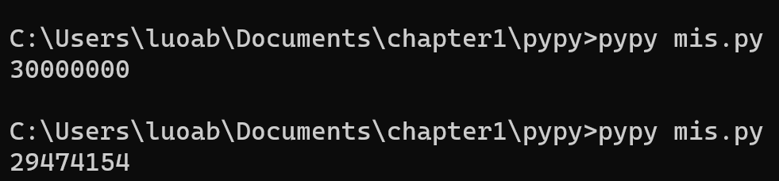
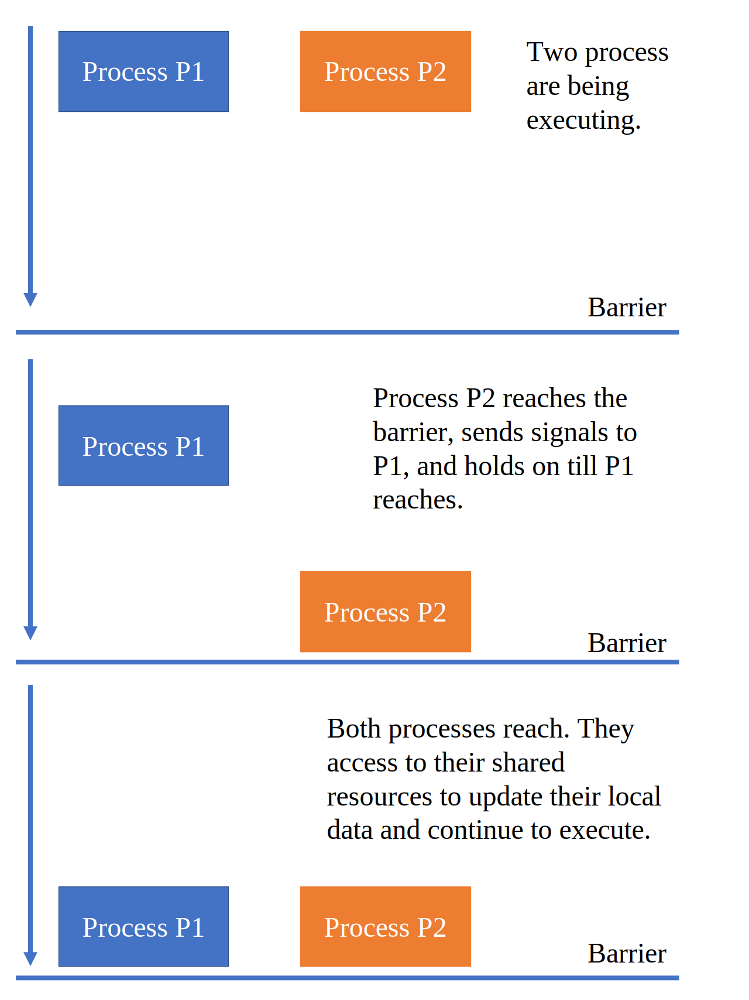
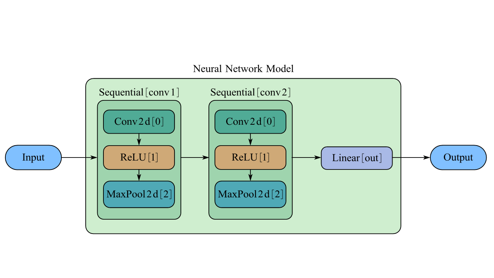

# 并行编程入门

之前我们编写的程序，一般来说都是单线程串行运行的。要想进一步提高运行速度，直觉上我们能够想到的就是将一个问题拆分为较小的几部分，然后这几部分要是能够同步执行就好了。每年的6月和11月，top500.org的网站上都会发布全世界的超级计算机最新排名；而对于这些超级计算机性能的评定方式，是通过运行一个基准测试程序，而这个基准测试程序在超级计算机上的运行，正是和我们直觉上认为的一样，将一个超大的矩阵运算分解为较小的若干部分，然后分别在不同的节点中进行计算。在本章中我们只了解并行编程最基本的概念，然后体验一番并行计算的效果。

### 7.1 认识并行计算

历史上，为了提高计算机的计算能力，人们想过可以通过提高处理器的频率，这样执行一条指令所需要的时间就更短。然而在处理器的发展过程中，功耗和散热成为了巨大的瓶颈，由于无法克服这些障碍，人们才被迫走上了多核心的道路，也就是在一块芯片上放置多个处理器。现在，家用的个人计算机一般都是六核或八核；在移动处理器领域，Snapdragon 888 Gen1也已经达到了8核（并且具有超大核、大核和小核之分）；既被用在桌面端也被用在移动端的Apple M1芯片也具有8核心（其中4个高性能大核心和4个高效能小核心）。总之，现代计算机几乎都是由多核、异构的计算单元组成的。

因此，为了充分利用好全部的计算资源，并行计算就显得尤为重要。通过在不同的核心上处理我们分解的小任务，就相当于是由一个人移山变成了多个人移山，愚公的愿望就能实现得更快了。

下面我们介绍两个最基本的概念：进程和线程。

#### 7.1.1 进程与线程

我们来看一个最简单的例子。

```c
#include <stdio.h>
int main(){
  printf("Hello, world!\n");
  return 0;
}
```

这一段代码可以由命令gcc hello.c -o hello编译为文件名为hello的可执行文件。像这样的文件在现代操作系统上运行时，操作系统会提供一种假象，好像系统上只有这个程序在运行。程序看上去是独占地使用处理器、主存和IO设备；处理器看上去就像是在一条接一条地执行程序中的指令——这个假象是通过**进程**这一抽象概念来实现的，而并发运行则是指不同进程之间的指令在处理器上交错运行。

对于一个单处理器的系统，在任何时刻它都只能处理一个进程的代码。于是，需要依靠操作系统来将控制权从一个进程切换到另一个进程。在切换之前，操作系统需要保存这个进程的全部状态（被称作**上下文**），当控制权切换回先前的程序时，进程就会从它上次停止的地方继续运行。

在现代操作系统中，一个进程实际上可以由多个执行单元组成，每一个执行单元被称为**线程**，每一个线程都运行在进程的上下文中，并共享同样的代码和全局数据。例如，PyPy中的threading库为我们提供了验证线程共享全局数据的方法。注意，Python具有的全局解释器锁（GIL）使得我们接下来的代码无法在最广泛使用的CPython解释器上运行，接下来的代码我们都用PyPy解释器来运行。

```python
from threading import Thread
import time

var = 0

def th1():
    global var
    var += 1

def th2():
    global var
    var += 1

def main():
    global var
    t1 = Thread(target=th1)
    t1.start()
    time.sleep(1)
    t2 = Thread(target=th2)
    t2.start()
    time.sleep(1)
    print(var)

main()
```

在这段代码中，我们先创建了两个线程，其作用都是将全局变量var加1。两个线程执行完成以后，变量var的值从0变成了2。

#### 7.1.2 并发与并行 并行编程模型

并发是一个通用的概念，指的是同一个系统能在同一时刻执行更多工作，而并行是指用并发来使一个系统运行得更快。

并行编程模型则是对硬件和内存架构的抽象。通常来说，广泛使用的模型有共享内存模型、多线程模型、分布式内存模型/消息传递模型、数据并行模型。

在共享内存模型中，所有任务共享一个内存空间，因而为了保证数据一致性，系统需要提供一些特殊的机制来控制共享内存的访问权限，例如信号量和锁机制。这进行了进一步的抽象，因而我们无需关心任务之间是如何切换和通信的；缺点在于这个模型存在的性能开销。

在多线程模型中，单个处理器可以有多个执行流。由于不同的线程可能会对共享内存进行操作，因此线程间的通信非常重要；必须要防止多个线程同时修改相同的内存单元，否则会造成意想不到的错误。POSIX是典型的用软件来实现多线程模型的案例；Intel处理器具有的超线程则是通过硬件实现多线程模型，它是基于CPU中某些部件具有备份，因此如果某一线程需要先将数据载入进高速缓存，那么CPU就可以先去执行另一个线程。

消息传递模型实质上是面向分布式内存的并行模型。假若我们有几台不同的设备，那么设备之间线通信就对设备间的并行十分重要。最广泛应用的标准是MPI(Message Passing Interface)模型，在Python中有mpi4py这个库可供我们调用。

数据并行模型相对好理解一些。在相同的任务中，对不同的数据进行操作，不同的数据被分隔在局部内存中，最典型的案例就是GPU。

### 7.2 基于线程的并行

PyPy具有线程标准库threading，能够进行更高标准的线程管理（相较于thread库）。接下来我们都使用这个库来实现基于线程的并行。

#### 7.2.1 创建一个线程 并发编程的危险

threading库将线程视作一个对象。要创建一个线程，最简单的方法就是实例化一个对象，并且使用start()方法启动它。我们先来考察一下实例化对象需要传入的参数。

```python
class threading.Thread(group=None,
                       target=None,
                       name=None,
                       args=(),
                       kwargs={})
```

group是保留参数，暂时不需要知道其含义；target是我们要执行的函数；name是创建的线程的名字，一般而言，默认会分配一个唯一的名字Thread-N；args是传入给线程的参数，使用tuple类型；kwargs则是传入参数名和参数值对应的字典类型。注意，args参数需要传入一个可迭代的对象，如果写为args=(i)就会报错。

```python
from threading import Thread
import time
import numpy as np

def work(i):
    time.sleep(np.random.rand())
    print("thread number:", i)
    
ts = []
for i in range(3):
    t = Thread(target=work, args=(i,))
    ts.append(t)
    t.start()
```

一切都还很顺利，我们似乎已经可以同时有多个线程工作了。但是，并发编程往往为我们带来无穷无尽的麻烦。例如，如果有两个线程同时对某个全局变量执行自增操作，那么全局变量会怎样变化呢？我们来看下面这个例子。

```python
import threading
ans = 0

def addnum():
    global ans
    for i in range(10000000):
        ans += 1


t0 = threading.Thread(target=addnum)
t1 = threading.Thread(target=addnum)
t2 = threading.Thread(target=addnum)
t0.start()
t1.start()
t2.start()
t0.join()
t1.join()
t2.join()
print(ans)
```

上面的代码得到的结果可能是正确的，也可能是错误的，例如29474154。



出现这种现象的原因在于，可能有两个线程同时读取了同一个内存地址，在进行了加法运算后又分别写回。这样，得到的结果就会小于我们预期的结果。更深层次的原因在于，对于现代多核心处理器而言，“程序的指令独占整个处理器执行”不再成立。对于一个单处理器系统而言，可能某一时刻线程的运行会中断，然后系统切换到另一线程运行；而对于多处理器系统，指令的执行本来就是并行的。有关这方面的更多的内容，我们会在《操作系统》这门课继续介绍。

思考题中，我们还留下了一个半开放的问题，有关并发编程不符合我们预期的结果。

#### 7.2.2 使用Lock进行线程同步

现在我们能借助threading库实现一个最重要的事情：同一时刻只允许一个线程访问共享变量。基本的思路是，为了访问共享变量，线程必须先获得锁，使用完后又必须释放锁；而线程获得锁和释放锁的过程是**原子操作**，即通过更为底层的软件或硬件的方法确保每一时刻只有一个线程在获取或者释放锁。

我们定义两个函数，一个函数的作用是对全局共享变量加1，另一个函数的作用是对全局共享变量减1。这样，我们就能实现这两个函数的交替执行（因为某个线程在第二次获得锁之前，必须先释放锁，这样另一个线程就获得锁了）

```python
import threading
lock = threading.Lock()
var = 0

def locked_inc():
    global var
    for i in range(10000):
        lock.acquire()
        var += 1
        lock.release()

def locked_dec():
    global var
    for i in range(10000):
        lock.acquire()
        var -= 1
        lock.release()

def main():
    global var
    t1 = threading.Thread(target=locked_inc)
    t2 = threading.Thread(target=locked_dec)
    t1.start()
    t2.start()
    t1.join()
    t2.join()
    print("var:", var)

main()
```

如果我们使用不加锁的版本，那么情况是

```python
import threading
var = 100

def locked_inc():
    global var
    for i in range(10000):
        var += 1

def locked_dec():
    global var
    for i in range(10000):
        var -= 1

def main():
    global var
    t1 = threading.Thread(target=locked_inc)
    t2 = threading.Thread(target=locked_dec)
    t1.start()
    t2.start()
    t1.join()
    t2.join()
    print("var:", var)
main()
```

可能某一次输出的结果是符合我们的预期的，但多运行几次就会出现其他超乎我们想象的结果。

理论上来说，我们已经完成了一个最基本的使用锁进行同步的程序了，但是，锁的使用往往还会带来一些其他问题，例如死锁和不必要的性能开销。接下来我们会介绍其他的方案。

#### 7.2.3 信号量 生产者消费者问题 哲学家吃饭

信号量是一种抽象的数据类型，它的机制是，信号量通常是一个整数，用来表明系统中有多少共享资源可以被调用。如果可以被调用的资源数为0，那么该线程就被挂起；反之则允许使用共享资源。在threading库中，信号量的操作同样包含acquire()和release()。考虑下面这种情形。

> 🍈现在有一个篮子，篮子最多能放下$n$个面包；最开始篮子里面没有蛋糕。生产线负责生产面包并将其放入篮子中，销售人员负责将面包从篮子中拿走。当篮子中面包数为0时，销售人员不能再拿走面包；当篮子中面包数为$n$时，生产线不能继续生产面包。

在这个例子中，可以设计两个信号量。第一个信号量empty初始值为5，第二个信号量full初始值为0。每放入1个面包，empty自减1，full自增1；每拿走一个面包，full自减1，empty自增1。最后，我们还需要第三个信号量mutex来保证生产线与销售人员对于篮子的放/取操作互斥。用代码实现就是

```python
import threading

lock = threading.Lock()
empty = threading.Semaphore(5)
full = threading.Semaphore(0)
buffer = 0

def producer():
    global buffer
    for i in range(20):
        empty.acquire()
        lock.acquire()
        buffer += 1
        print("buffer + 1, buffer = %d" % buffer)
        lock.release()
        full.release()

def consumer():
    global buffer
    for j in range(20):
        full.acquire()
        lock.acquire()
        buffer -= 1
        print("buffer - 1, buffer = %d" % buffer)
        lock.release()
        empty.release()

def main():
    global buffer
    t1 = threading.Thread(target=producer)
    t2 = threading.Thread(target=consumer)
    t1.start()
    t2.start()
    t1.join()
    t2.join()
    print("buffer:", buffer)

main()
```

这就是著名的生产者-消费者问题；应当说绝大多数实际的并发模型都可以使用这个模型来处理。初学者常常有这样的疑问，只用一个信号量行不行？而且还可以写出下面这样的代码。

```python
import threading
buffer = 0
sig = threading.Semaphore(5)
mutex = threading.Lock()

def producer():
    global buffer
    for i in range(20):
        mutex.acquire()
        sig.acquire()
        buffer += 1
        print("buffer + 1, buffer = %d" % buffer)
        mutex.release()

def consumer():
    global buffer
    for j in range(20):
        mutex.acquire()
        sig.release()
        buffer -= 1
        print("buffer - 1, buffer = %d" % buffer)
        mutex.release()

def main():
    global buffer
    t1 = threading.Thread(target=producer)
    t2 = threading.Thread(target=consumer)
    t1.start()
    t2.start()
    t1.join()
    t2.join()
    
main()

```

看上去好像没有什么问题，但是，producer是不受限制的，也就是说，进程t1可以一直往篮子里面放面包。使用两个信号量的功能在于，一个信号量用于制约生产者，另一个信号量用于制约消费者。所以，在整个生产者-消费者模型中，我们需要使用到的是一个锁和两个信号量。

现在，你可以自行设计出一套方案，解决下面由Dijkstra提出并解决的哲学家吃饭问题。顺带一提，信号量也是由E.Dijkstra发明并第一次应用在操作系统的。请使用锁和信号量来实现这个过程。

> 🍈五个哲学家共用一张圆桌，分别坐在周围的五张椅子上，在圆桌上有五个碗和五把叉子，他们的生活方式是交替的进行思考和进餐。平时，一个哲学家进行思考，饥饿时便试图取用其左右最靠近他的筷子，只有在他拿到两只筷子时才能进餐。进餐完毕，放下筷子继续思考。

在线程的同步问题上，还有其他一些广泛使用的方案，例如使用事件、条件变量和递归锁进行同步；如果我们的问题较为复杂，以至于我们无法使用这些同步原语（例如信号量，条件变量，事件和锁），我们还能够使用queue模块通过队列来解决。

### 7.3 基于进程的并行

#### 7.3.1 创建一个进程

创建一个进程需要使用到multiprocessing库，如下面的代码所示，我们就创建了3个进程。

```python
import multiprocessing

def hello(i):
    print ('hello from: %d' % i)

jobs = []
if __name__ == "__main__":
    for i in range(3):
        p = multiprocessing.Process(target=hello, args=(i,))
        jobs.append(p)
        p.start()
        p.join()
```

#### 7.3.2 进程之间的同步

与线程之间的同步类似，进程间同步的原语包括锁、时间、条件变量、信号量、障碍等。下面，我们只简单介绍使用添加障碍的方式实现进程间的同步。

```python
import multiprocessing
import time
from datetime import datetime

def pro1():
    time.sleep(1)
    now = time.time()
    print(datetime.fromtimestamp(now))

def pro2():
    time.sleep(2)
    now = time.time()
    print(datetime.fromtimestamp(now))

if __name__ == '__main__':
    p1 = multiprocessing.Process(target=pro1)
    p2 = multiprocessing.Process(target=pro2)
    p1.start()
    p2.start()

```

在上面的代码中，我们创建了两个线程，并在合适的时候输出当前时间。理论上说，我们p1和p2输出的时间差会是1秒。

使用barrier()函数可以使两个进程同步。基本的思路如下图所示，即某一个进程如果运行较快到达了障碍点，那么就向另一个进程发出信号，并且等待；当两个进程都运行到了障碍点，此时就可以交换数据，然后越过障碍点继续运行。



于是写成代码就是

```python
import multiprocessing
import time
from datetime import datetime

def pro1(synchronizer, serializer):
    time.sleep(1)
    synchronizer.wait()
    now = time.time()
    with serializer:
        print(datetime.fromtimestamp(now))

def pro2(synchronizer, serializer):
    time.sleep(2)
    synchronizer.wait()
    now = time.time()
    with serializer:
        print(datetime.fromtimestamp(now))

synchronizer = multiprocessing.Barrier(2)
serializer = multiprocessing.Lock()
if __name__ == '__main__':
    p1 = multiprocessing.Process(target=pro1, args=(synchronizer,serializer))
    p2 = multiprocessing.Process(target=pro2, args=(synchronizer,serializer))
    p1.start()
    p2.start()

```

此处，在两个函数中我们都用到了with方法，以pro1为例，实际上它们等同于

```python
def pro1(synchronizer, serializer):
    time.sleep(1)
    synchronizer.wait()
    now = time.time()
    serializer.acquire()
    try:
        print(datetime.fromtimestamp(now))
    finally:
        serializer.release()
```

实施上就是Python支持的with语法，在这里finally语句不论try语句是否执行成功都会执行。

#### \*7.3.3 在Python中使用MPI

首先需要安装MPI软件，一般来说有openmpi或mpich；然后需要安装mpi4py这个库，安装方法为pip install mpi4py。

一个最简单的程序如下所示。

```python
from mpi4py import MPI
comm = MPI.COMM_WORLD
rank = comm.Get_rank()
print("hello world from process ", rank)
```

然后我们在终端中执行

```python
mpiexec -n 5 python hello.py
```

在这个程序中，comm是所有程序的集合；rank是由MPI分配的非负数，其值依次是从0到总进程数减1。通过Get\_rank()函数，能够获得当前运行的进程的编号。

点对点通信使用send()和recv()方法，例如下面的代码片段展示了进程0向进程1发送数据并被进程1接收的实例。这两个函数都是阻塞函数，也就是说在数据使用完成前，这两个函数所在的进程都会被阻塞。

```python
from mpi4py import MPI
comm = MPI.COMM_WORLD
rank = comm.rank
print("Process rank", rank)

if rank == 0:
    data = "hello from rank 0"
    destination_process = 1
    comm.send(data,dest=destination_process)
    print("sending data to process % d" % destination_process)

if rank == 1:
   data = comm.recv(source = 0)
   print("data received is = % s" % data)
```

### 7.4人工智能中的并行

一般来说，推动人工智能发展的主要是以下三个因素：算法、训练数据、算力。OpenAI 提出，自 2012 年以来，人工智能训练任务中使用的算力正呈指数级增长，直到2018年，其速度为每 3.5 个月翻一倍（相比之下，摩尔定律是每 18 个月翻倍）。

然而，越来越大的模型成为了工业界追捧的事物，以自然语言模型为例，2018年到2022年，模型的参数量从94M迅速增长到了530B。不论是在学界还是工业界，分布式训练已经成为解决大模型训练的唯一途径。以2021年Microsoft和NVIDIA共同发布的Megatron-Turing自然语言生成模型（MT-NLG）为例，它拥有5300亿参数，是在基于NVIDIA DGX SuperPOD的Selene超级计算机上完成训练的；这个超级计算机集群一共拥有560台DGX A100服务器，而每台服务器都拥有八张NVIDIA A100加速卡，显存为80GB。

面对如此庞大的模型，并行训练十分必要和有效。在实际的训练中，就包含了数据并行、张量并行、模型并行、管道并行等方案。在这一节中，我们将构建一个用于手写体识别的卷积神经网络的模型，并且使用horovod进行并行训练。

#### 7.4.1模型构建

具体的细节我们就不过多介绍了，接下来的模型在对MNIST数据集的手写体识别上具有非常好的效果。



用代码实现是

```python
class Mnist_nn(nn.Module):
    def __init__(self):
        super(Mnist_nn, self).__init__()
        self.model = nn.Sequential(
            nn.Conv2d(in_channels=1,
                      out_channels=6,
                      padding=0,
                      kernel_size=(5, 5),
                      stride=(1, 1)),
            nn.ReLU(inplace=True),
            nn.MaxPool2d(kernel_size=2, stride=2),
            nn.Conv2d(6, 16, (5, 5), stride=(1, 1)),
            nn.ReLU(inplace=True),
            nn.MaxPool2d(kernel_size=2, stride=2),
            nn.Flatten(),
            nn.Linear(256, 128),
            nn.Linear(128, 64),
            nn.Linear(64, 10)
        )

    def forward(self, x):
        x = self.model(x)
        return x

```

我们将其保存到model.py，然后在相同的目录下创建train.py文件，里面的内容为

```python
def nnrun():
    for i in range(global_epoch):
        print("第%d轮训练" % (i + 1))
        time0 = time.time()
        for data in mnist_dataloader:
            img, tag = data
            img = img.to(device)
            tag = tag.to(device)
            outimg = mnist_nn(img)
            loss = loss_function(outimg, tag)

            optimizer.zero_grad()
            loss.backward()
            optimizer.step()
            global_train_step += 1

            if global_train_step % 1000 == 0:
                print("step=%d时，损失值为%f" % ((global_train_step), loss.item()))

        time1 = time.time()
        print("第%d轮训练用时%f" % ((i + 1), (time1 - time0)) + "秒")

        local_accuracy = 0
        accuracy_rate = 0
        with torch.no_grad():
            test_len = len(test_data)
            for test in test_dataloader:
                img, tag = test
                img = img.to(device)
                tag = tag.to(device)
                testout = mnist_nn(img)
                accuracy = (testout.argmax(1) == tag).sum()
                local_accuracy += accuracy
                accuracy_rate = local_accuracy / test_len
            print("正确率为%f" % accuracy_rate)

        if accuracy_rate >= 0.95:
            torch.save(mnist_nn.state_dict(), "mnist.model")
            break
```

然后创建main.py文件，内容为

```python
import torch
from torch import nn
from torch.utils.data import DataLoader
import torchvision
import time
from model import Mnist_nn
from train import 
device = torch.device("cuda" if torch.cuda.is_available() else "cpu")
mnist_data = torchvision.datasets.MNIST(root="./data",
                                        train=True,
                                        transform=torchvision.transforms.ToTensor(),
                                        download=True)
test_data = torchvision.datasets.MNIST(root="./data",
                                       train=False,
                                       transform=torchvision.transforms.ToTensor(),
                                       download=True)
mnist_dataloader = DataLoader(dataset=mnist_data,
                              batch_size=128,
                              shuffle=True,
                              num_workers=0)
test_dataloader = DataLoader(dataset=test_data,
                             batch_size=128,
                             shuffle=True,
                             num_workers=0)

mnist_nn = Mnist_nn()
mnist_nn = mnist_nn.to(device)


loss_function = nn.CrossEntropyLoss()
loss_function = loss_function.to(device)

learning_rate = 1e-2
optimizer = torch.optim.SGD(mnist_nn.parameters(), lr=learning_rate)

global_train_step = 0
global_epoch = 40

nnrun()
```

现在运行main.py，就能够开始训练这个模型了。现在我们加入horovod的一些必要代码片段，程序的结构大致是

```python
import ...
import horovod.torch as hvd

hvd.init()

datasets = ...
model = ...
optimizer = optim.SGD(model.parameters())

optimizer = hvd.DistributedOptimizer(optimizer, named_parameters=model.named_parameters())

hvd.broadcast_parameters(model.state_dict(), root_rank=0)

for i in range(epoch):
    train()
```

现在，使用命令

```python
horovodrun -np 4 python train.py
```

就能够通过4个进程来进行训练。如果有多台设备，还能为每台设备指定进程数，例如

```python
horovodrun -np 8 -H hostname1:4,hostname2:4 python train.py
```
