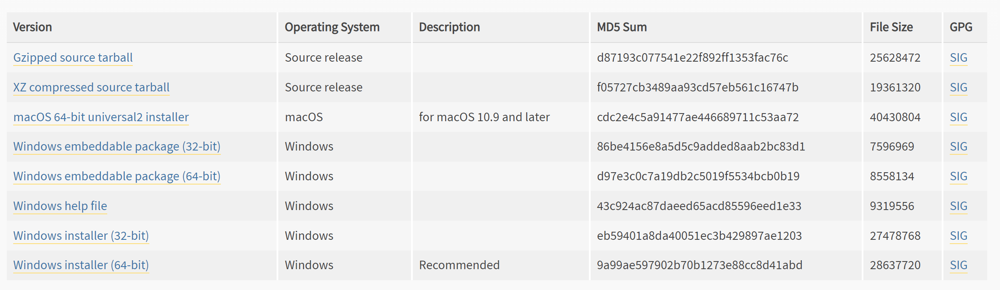
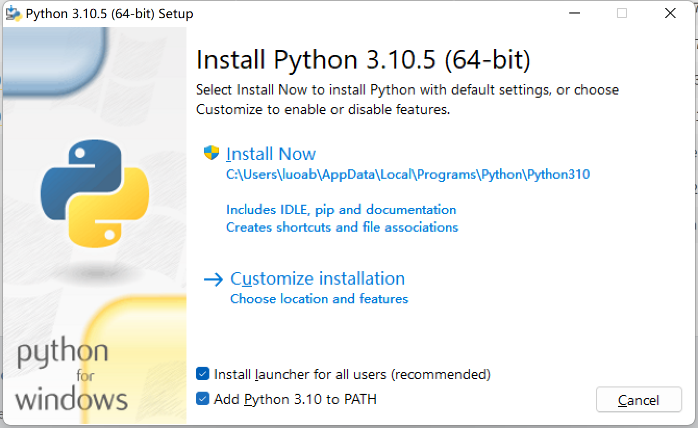
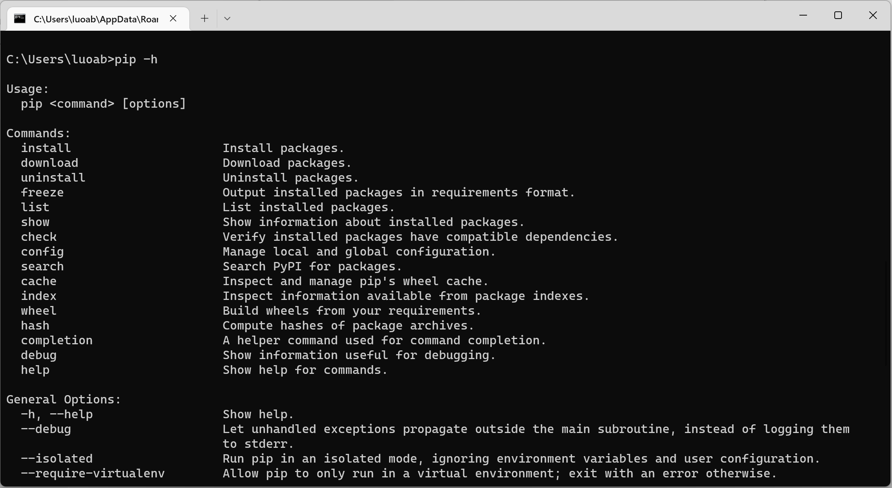
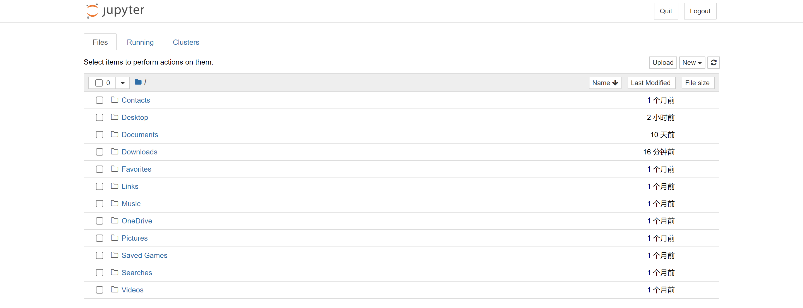
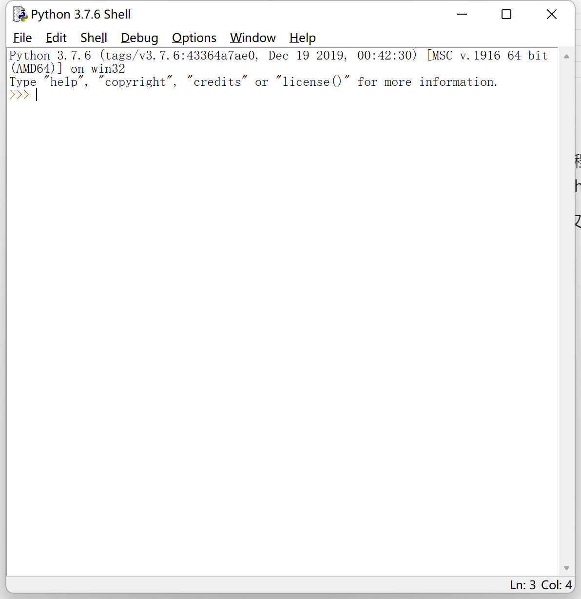

# 获取Python解释器

Python是一门解释型语言。换言之，我们编写的Python程序通常不能直接运行在没有Python解释器的环境下。一般而言，大学的机房中已经有计算机管理员为每一台电脑配置好Python运行环境，甚至还会准备Anaconda为科学计算应用准备好需要的大多数第三方资源；如果你能够连接到学校机房中的计算机，你完全可以远程地安装和运行程序。当然，对于有WSL支持的Windows系统，你也可以在自己的电脑上安装著名的Linux发行版——Ubuntu，并且这个系统已经为你准备好了完整的Python开发环境。

### 在Windows下安装Python解释器

经过多个版本的更迭，在Windows下安装Python解释器已经变得相对容易了。你只需要访问[https://www.python.org/](https://www.python.org/ "https://www.python.org/")，在downloads下选择Windows平台，再选择你需要的版本的installer就可以下载了。



安装过程是相对容易的，你只需要保持一切都是默认选项，并且将Python添加到PATH。将Python添加到PATH能够确保你可以通过命令行启动它。点击Install Now，这样就能完成安装。



### Jupyter的使用

安装完成Python解释器后，在命令行中打出pip -h并回车，应当会反馈pip的各种用法。pip是Python第三方包的管理工具，这些第三方包将为我们之后的学习提供极大的方便。我们只需要去调用前人已经写好的工具，而无需大费周章自己实现某些功能。



现在我们就将体验pip提供的巨大便利。首先，我们需要输入

```纯文本
pip config set global.index-url https://pypi.tuna.tsinghua.edu.cn/simple
```

回车，将我们下载第三方包的镜像源切换到此；然后输入`pip install jupyter`，pip就会自动安装jupyter。安装完成后，只需要输入`jupyter notebook`，就能够进入jupyter提供的在线实时编程和运行的网页界面。这为初学者提供了极大的方便。



### 使用IDLE

IDLE是Python自带的轻量级的文本编辑器。只需要在程序栏中找到它，就可以直接运行它。你既可以交互式地使用它编写Python代码，也能使用IDLE创建Python文件，将你的作品保存到计算机上。

在教学中，我们既可能使用jupyter提供的编程环境，又可能直接使用IDLE。


