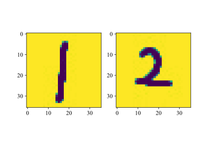
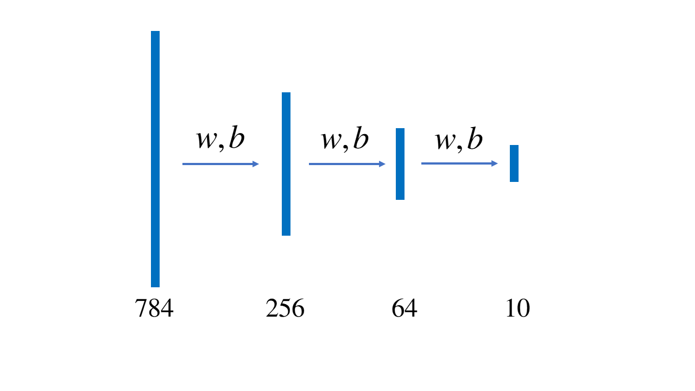

# 实验：手写体识别

### 背景

作为一门计算机科学的导论课，我们当然需要把计算机科学的各个分支都融合进这门课程中——显然，少不了当下十分热门，并深刻地改变了人类社会的一个分支——机器学习。现在，我们就将走进机器学习的大门。在此之前，我们有必要来速成一下有关神经网络和机器学习的内容。

在IEEE（电气和电子工程师协会，读作eye-triple-ee）网站上我们能找到J. von Neumann于1945年发表的*First draft of a report on the EDVAC*一文，在这篇文章中，J. von Neumann引入了MacCulloch和W. Pitts的神经元模型；可见人类对于神经元模型的探索是伴随着计算机被创立就开始了。这也很好理解，因为起初人们就是希望模仿人脑进行计算机的制造，而人脑神经的工作方式，自然而然就成为了研究和模仿的重点。在计算机科学的发展中，这一模型还进一步发展成为感知机，而后就是我们熟悉的机器学习与人工智能了。

下面我们展现了一个最基本的神经元模型。

这个神经元工作的方式是，接受数据的某些特征$x_1,x_2,x_3$的输入，并将其分别乘以权重（weight），再减去偏置值$b$，将得到的结果放入激活函数$f(x)$，最后得到输出$y$。激活函数是非常重要的一环，它能够将我们的输出统一起来，而不会出现某两个输出值相差特别巨大的情况。在《语言基础》一章中，我们就曾经构建过著名的激活函数ReLU。

如图所示，在一个三维空间中我们有若干个点，有的是橘色，有的是蓝色。假设我们通过神经元对橘色的点和蓝色的点进行分类。这两种点都具有的特征是坐标$(x,y,z)$，我们将其作为$(x_1, x_2, x_3)$输入神经元。乘以权重，减去偏置；假设我们的激活函数就是ReLU函数，再将得到的值放入激活函数，即

$$
y=\mathrm {relu}(w_1x_1+w_2x_2+w_3x_3)
$$

假设我们认定$y>0$表示我们通过这个点的信息，预测这个点是蓝色；$y<0$是橘色。那么假如某个点本来是蓝色，但是带入这个点的坐标以后通过我们的计算$y<0$，那么说明我们的权重$(w_1, w_2, w_3)$和偏置$b$的选取有问题，这时候我们就需要调整参数，直到我们能够区分出绝大多数点。

这个时候，如果我们绘制出$w_1x_1+w_2x_2+w_3x_3-b=0$，即$w_1x+w_2y+w_3z-b=0$，我们事实上是得到了三维空间中的一个平面。这个平面将大多数蓝色和橙色的点分隔开。

总而言之，在这个最基本的神经网络模型中，进行机器学习的步骤就是选取特征、计算值、调整参数、得出结果。

### 实验内容

MNIST是一个著名的手写体识别数据集，由美国国家标准与技术研究所（National Institute of Standards and Technology, NIST）公开。训练集 (training set) 和测试集(test set) 都由来自 250 个不同人手写的数字构成；其中 50% 是高中学生，50% 来自人口普查局的工作人员。

第一步是将这些图片都读进我们的内存。在《输入与文件读取》一章中我们已经了解了如何将这些文件读入，并且转化为NumPy中的array。实际上，MNIST的训练集直接提供了60000张28×28的图片，它们都以二进制的方式进行存储。在本实验的要求下，你也可以使用第三方库（例如Keras和Pytorch）导入现成的数据集。

现在，我们需要考虑我们数据具有哪些特征。和下面所示的图片一样，数字1和2的差别在于在某些位置，数字1的图片的像素值为255（白色），而数字2的图片不是。通过这个特征，我们可以把数字1和数字2区分开来。

现在，我们将这个28×28的矩阵展平，成为一个1×784的向量。对于任何一个数字来说，它对应的图像像素值不为255的点集中在某个区域；或者说，对于某张图片，如果其像素值不为255的点集中的区域和我们认定的数字1的许多张图片非常接近，那么我们就认定这张图片所示的数字为1。

然后，我们需要来确定权重和偏置的初始值。这非常好解决，从理论上来说，只需要随机生成权重和偏置的初始值，经过我们一轮又一轮地训练，我们肯定能通过参数的调整，将权重和偏置调整到合适的值。随着研究的深入，我们会发现超参数的初始值选取具有一些小技巧；在这里，我们就简单地将$w_i$的初始值设置为$(0, 1)$间的随机数，将$b$的初始值设置为$0$。

在实验背景的介绍中，我们忽略了一个十分重要的问题：如何实现参数的自动调整？这个问题的关键在于，假设我们称实际值为$Y$，预测值为$y$，那么差值就是$(Y-y)$，我们要设计一个方案，使得参数调整以后$(Y'-y')$的值更小。我们再给出一点提示，在相同的$w_i$条件下，$x$越大，那么对$y$的影响也就会越大；而由于$Y'$是一个常数，所以对$(Y'-y')$的影响也就会越大。偏置$b$的值调整的方法是类似的。如果你现在不能够推导出这个公式也没关系，我们之后会提到它。

上面我们只是简单地介绍了一些关于神经网络的最基本的内容，但希望这些最基本的内容能够帮助我们完成手写体识别的任务，还是有些困难的，所以我们还需要介绍一些其他知识。

#### 输出分析

首先我们需要介绍**激活函数**这个概念。在计算的过程中，得到的结果可能相差十分巨大，因此科学地选用激活函数能够让我们的模型更快收敛，达到事半功倍的效果。在这个实验中，我们将选用sigmoid函数，它的值域是(0,1)，同时它的导函数也非常容易计算。

$$
\mathrm{sigmoid}(x)=\frac{1}{1+\mathrm e^{-x}} \\ 
\frac{\mathrm{d}(\mathrm{sigmoid})}{\mathrm{d}x}=\frac{\mathrm e^{-x}}{(1+\mathrm e^{-x})^2}=(1-\mathrm{sigmoid}(x))(\mathrm{sigmoid}(x))
$$

我们在每一次矩阵乘法之前，都先进行一次激活函数的调用。然后就可以得到下面这个简单的模型。

我们已经说明过，这不是一个二分类问题，而是一个多分类问题。对于二分类问题，我们显然可以在784维超空间中找到一个783维的超平面将两种数字的手写体分开。但是，我们现在希望的是将10种手写体图片分开。因此，要用到Softmax分类器。上图中，通过我们的操作，将一个1×784的向量变换成一个1×10的向量$ \vec{n}  $。我们对向量$\vec{n}$需要进行处理得到向量$\vec{m}$，使得各个元素都大于零且加起来的和等于1。我们的目标是，数字0的手写体识别结果中，对应这个向量第1个元素（下标为0）的值应当最大，以此类推，数字9的识别结果中，对应的这个向量第10个元素（下标为9）的值应当最大。这样，当我们预测一幅图片时，我们只需要找到结果向量中最大的值对应的下标，就能判断我们识别的结果是哪个数字了。

从$\vec{n}$得到$\vec{m}$，需要使用Softmax函数。

$$
\mathrm{softmax}(x_i)=\frac{e^{x_i-D}}{\sum_{j}e^{x_j-D}}
$$

其中，$x_i$和$x_j$是$\vec{n}$中的每一个元素，$D$是$\vec{n}$中元素的最大值。

#### 损失函数 梯度下降

开始实现参数的自动调整啦！但是有一个问题，单纯地使用$x_i(Y-y)$和$(Y-y)$来计算每次$w_i$和$b$要调整多少似乎太粗糙了一些，所以我们要从更科学的角度来观察这个问题，我们需要找到一个更合理的方式来刻画我们当前的结果与期望的结果之间的关系，于是我们需要引入交叉熵损失函数。

$$
\mathrm{Loss}=-\frac{1}{N}\sum_{i=0}^{N-1}\ln(p_i)
$$

好了，现在我们可以认为，损失是关于权重的一个函数，既然我们要求损失的极小值，那么我们希望损失的导数为0。面向导论课程，我们简单认为，此处的损失可以用损失函数来体现，于是我们直接按照偏导数的定义就可以计算了。

### 实验指导

事实是，我们这一个实验的目的并不是要让你从零开始完成一个神经网络的搭建。Python作为一个胶水语言，有很多现成的第三方包可供我们调用，在机器学习领域也不例外。现在你只需要查阅Pytorch官方文档，就能找到我们刚刚说到的所有函数。针对MNIST数据集进行手写体识别还有其他更完善的模型，但是本实验的要求是按照《实验内容》部分的模型，使用Pytorch搭建神经网络，完成模型的训练。然后，在测试集上测试模型的准确率。

> 🍈【拒绝内卷】实验只要求建立前向神经网络，测评机制只考虑是否建立了这样的网络，对其性能和在测试集上的准确率不做要求；反向网络能够极大减少训练时间，但是完成这一部分的内容并不会提高分数。

### 交流与讨论

1\. Pytorch进行了更抽象的封装，因此我们不必在乎具体的函数和方法是如何实现的。在这种情况下，我们如何加速模型的训练？

2\. 增大batch size后，损失函数的值随训练的进行是收敛更快了还是更慢了？为什么？

3\. 手写体识别还有其他的神经网络模型可以使用，例如MNIST的维护者Yann LeCun的著名论文Y. LeCun, L. Bottou, Y. Bengio and P. Haffner: **Gradient-Based Learning Applied to Document Recognition**, *Proceedings of the IEEE, 86(11):2278-2324, November \*\***1998***中提到的卷积神经网络模型。不同的模型具有不同的效果，如果你感兴趣，可以继续做深入的了解。
