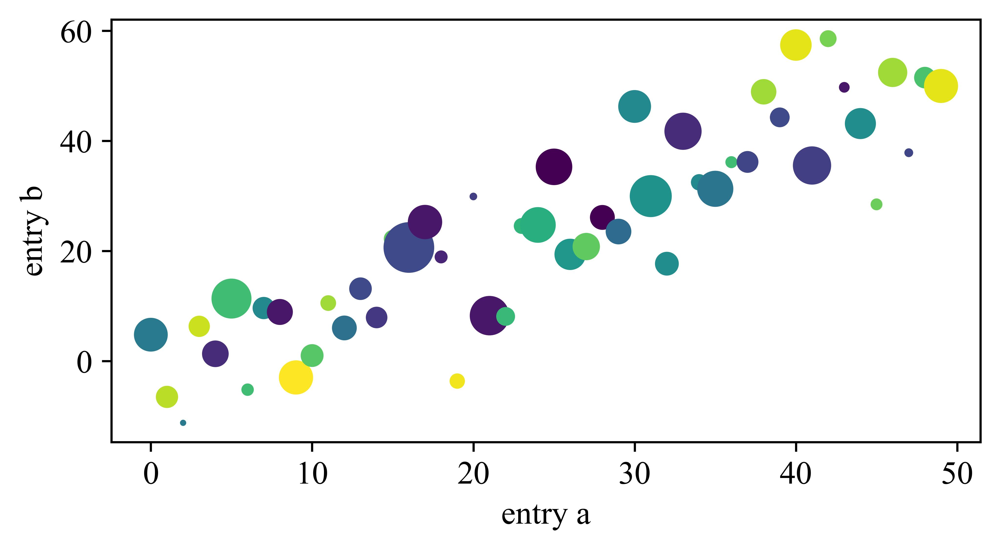
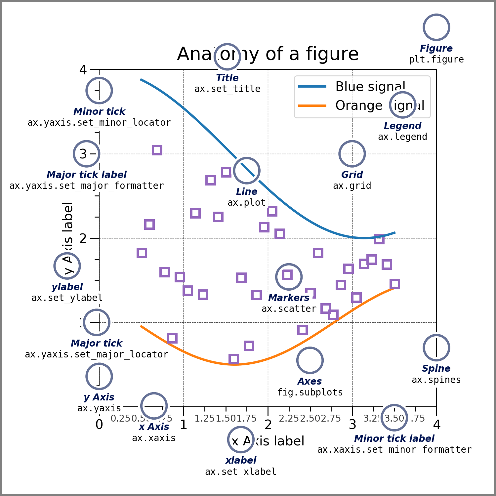
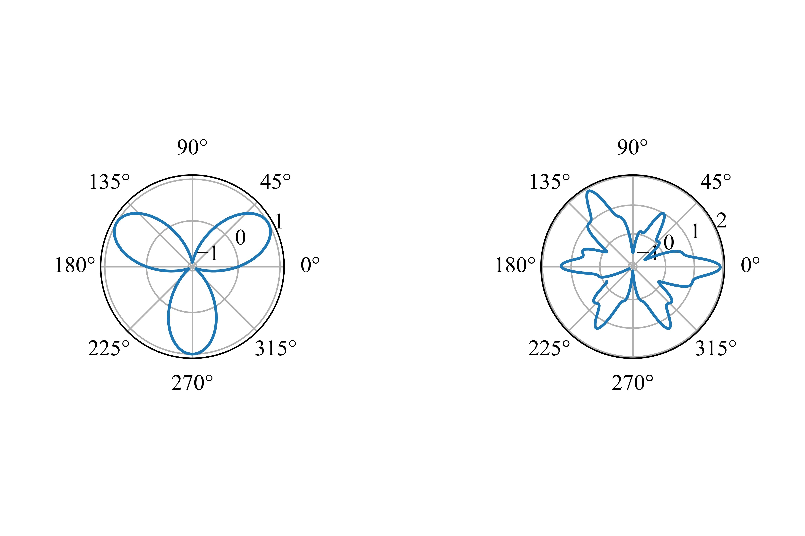
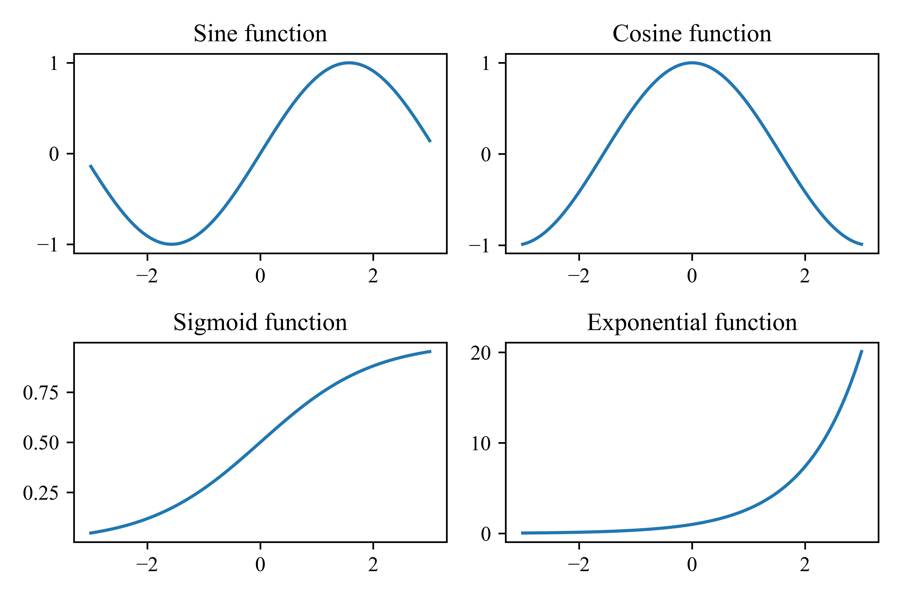
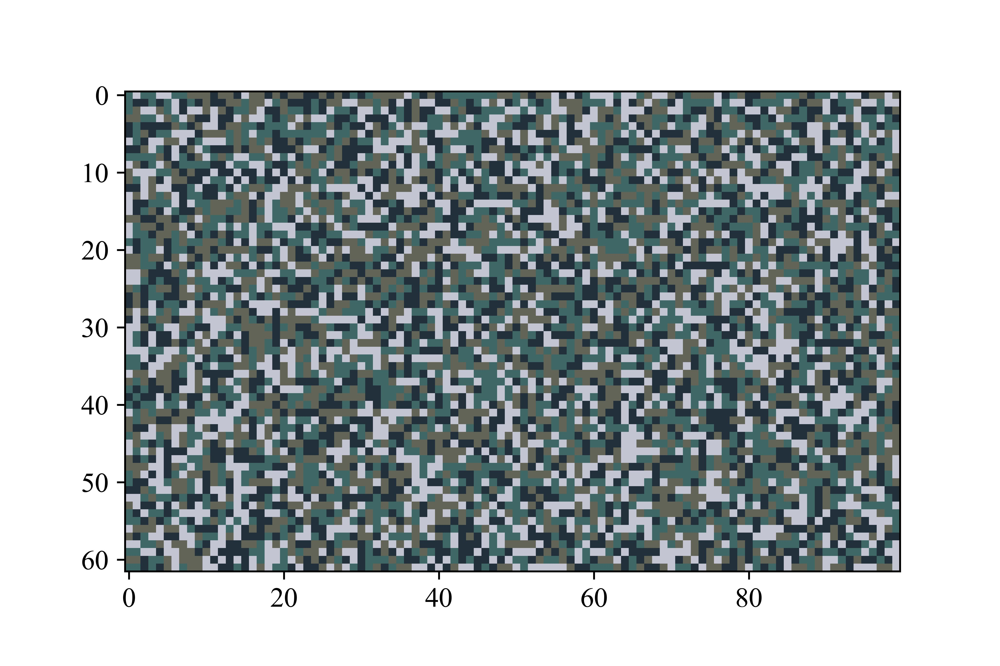

# 科学计算与曲线绘图

### 3.1数值处理库NumPy

NumPy指的是数值Python，即Numerical Python，它是一个可以用来处理数组的开源的Python库。在Python中，列表就能充当数组的作用，但列表的访问实在是太慢了。NumPy部分地改善了这个问题，并且在处理NumPy的数组时，能达到大约比Python原生列表快50倍的速度。

一般而言，例如Anaconda这样的科学计算集成包已经提供了NumPy。如果`import numpy`执行不成功，则需要在命令行中执行

```bash
pip install numpy
```

#### 3.1.1数组的基本操作

通常我们使用np作为别名来引入NumPy。这样我们的代码看上去会简洁一些。

```python
import numpy as np
arr = np.array([1, 2, 3, 4, 5, 6])
print(arr)

```

我们刚刚创建的`arr`是一个数组对象，类型是`ndarray`，这个数组是一维的。与创建多维列表相同，我们能创建多维的数组。事实上只是传入一个二位列表而已。

```python
arr0 = np.array(42) # 零维数组(一个数)
arr2 = np.array([[1, 2], [3, 4], [5, 6]]) # 二维数组
```

我们也可以查看一个数组的维数。

```python
print(arr2.ndim)
```

要知道一个数组确切的形状（即明白这个m×n的矩阵中，m和n的具体值），我们可以调用

```python
print(arr2.shape)
```

对于某个数组，我们也可以改变它的形状。这在机器学习的某些领域可能非常有用。例如，我们希望将上方的`arr2`变为一个三维矩阵，那么我们可以

```python
arr3 = arr2.reshape(2, 3, 1)
```

上面的语句的含义是将`arr2`的形状变为一个三维矩阵，这个三维矩阵包含两个数组，每个数组内包含三个小数组，每个小数组内包含一个元素。只要变换前后数组内元素总的个数是相同的，都能进行变换。当然，如果我们不想大费周章计算每一个传入的参数具体应该是什么值，我们可以将某个参数设置为-1，NumPy会自动帮我们计算出这个参数的值。例如，在上面的案例中，我们也可以写为

```python
arr3 = arr2.reshape(-1, 3, 1)
```

NumPy会自动帮助我们计算得出传入的第一个参数应该为2。

NumPy数组通过下标的元素访问、数组切片等操作与列表是一致的。

#### 3.1.2数组中的数据类型

除了Python原生支持的数据类型外，NumPy还对一些数据类型有特殊的支持。你可以通过

```python
import numpy as np
array_int = np.array([1, 2, 3, 4], dtype='i4') # 每个整数占四个字节，即32位
array_ll = np.array([1, 2, 3, 4], dtype='i8') # 每个整数占八个字节，即64位
print(array_int.dtype)
print(array_ll.dtype)
```

来强制指定某个数采用什么样的方式存储，以及查看某个数组元素的数据类型。

当然，我们也可以对一个数组进行强制类型转换。例如，

```python
array_int = np.array([1, 2, 3, 4], dtype='i4')
array_flt = array_int.astype('float')
print(array_flt.dtype)
```

#### 3.1.3矩阵运算

使用NumPy可以很方便地创建一个矩阵，就像创建一个数组一样；但是矩阵能支持一些矩阵专有的运算，而数组不支持。

```python
import numpy as np
matrix = np.mat([[1, 2], [3, 4]])
print(matrix)
```

接下来，我们逐一查看NumPy支持的我们在《线性代数》中常见的一些运算。

*   矩阵的转置

```python
import numpy as np
matrix_A = np.mat([[1, 2], [3, 4]])
matrix_B = matrix_A.T
print(matrix)
```

*   同型矩阵相加减

```python
mA = np.mat([[1, 3, 5], [2, 8, 4]])
mB = np.mat([[3, 2, 6], [9, 7, 1]])
mC = mA + mB
print(mC)
mC = mA - mB
print(mC)
```

*   矩阵的内积

```python
mA = np.mat([[1, 3, 5], [2, 8, 4]])
mB = np.mat([[3, 2, 6], [9, 7, 1]])
mC = mB.T
mD = mA.T
print(np.dot(mA, mC))
print(np.dot(mB, mD))

```

*   创建单位矩阵、零矩阵、1矩阵。请观察它们之间的细微差别

```python
mA = np.eye(3)
mB = np.zeros(3)
mB_ = np.zeros((3, 3))
mC = np.ones(3)
mC_ = np.zeros((3, 3))
print("mA:")
print(mA)
print("mB:")
print(mB)
print("mB_:")
print(mB_)
print("mC:")
print(mC)
print("mC_")
print(mC_)
```

*   求方针的迹（trace），迹就是方阵的主对角线元素之和。

```python
matrix = np.mat([[1, 3, 8], [2, 2, 5], [6, 8, 2]])
print(np.trace(matrix))
```

*   求逆矩阵$A^{-1}$

```python
m = np.mat([[6, 8, 4], [3, 7, 2], [1, 7, 1]])
print(np.linalg.inv(m))
```

#### 3.1.4行列式运算

相较于矩阵来说，行列式事实上是一个数。通过一定的规则（例如Laplace展开定理），我们可以将这个数计算出来。

*   创建方阵并计算其行列式

```python
m = np.mat([[6, 8, 4], [3, 7, 2], [1, 7, 1]])
print(np.linalg.det(m))

```

*   求伴随矩阵，伴随矩阵满足$A^*=|A|A^{-1}$

```python
m = np.mat([[6, 8, 4], [3, 7, 2], [1, 7, 1]])
m_det = np.linalg.det(m)
m_inv = np.linalg.inv(m)
m_acc = m_det*m_inv
print(m_acc)
```

#### 3.1.5线性方程组的求解

假设我们有一个线性方程组

$$
\begin{cases}a_{11}x_1+a_{12}x_2+a_{13}x_3+a_{14}x_4=b_1
 \\a_{21}x_1+a_{22}x_2+a_{23}x_3+a_{24}x_4=b_2
 \\a_{31}x_1+a_{32}x_2+a_{33}x_3+a_{34}x_4=b_3
 \\a_{41}x_1+a_{42}x_2+a_{43}x_3+a_{44}x_4=b_4
\end{cases}
$$

那么，我们可以将$x$前面的系数抽取出来，构成一个4×4的矩阵

$$
A=\begin{bmatrix}
 a_{11} & a_{12} & a_{13} & a_{14} \\
 a_{21} & a_{22} & a_{23} & a_{24} \\
 a_{31} & a_{32} & a_{33} & a_{34} \\
 a_{41} & a_{42} & a_{43} & a_{44}
\end{bmatrix}
$$

同样，我们也可以将等号右边的常数项抽取出来，得到一个行向量

$$
B = (b_1,b_2, b_3, b_4)
$$

然后我们将这两个参数传入，就能求解方程组。注意，传入的第一个参数是系数矩阵，传入的第二个参数是常数项组成的向量。系数矩阵既可以采用np.mat，也可以采用np.array；但行向量应当使用np.array。

```python
mA = np.array([[1, 3, 2, 4], [0, 2, 4, 1], [3, 5, 2, 6], [4, 2, 8, 6]])
mB = np.array([4, 8, 12, 6])
res = np.linalg.solve(mA, mB)
print(res)
```

### 3.2随机数

#### 3.2.1程序的状态机模型简介 随机数的产生

开始之前，我们要插入一段题外话——让我们思考一件事情——什么是程序？请看下面的简单例子。

$$
X'=\neg X \wedge Y \\
$$

$$
Y'= \neg X \wedge \neg Y
$$

我们简单地将$X$和$Y$视作两个变量；是其中$X'$和$Y'$是下一时刻$X$和$Y$的值。假设$X$和$Y$最开始的值都是0，我们可以通过运行下面这段代码来体验一下$X$和$Y$的变化。

```python
import time
X = 1
Y = 1
while(1):
    _X = (not X) and Y
    _Y = (not X) and (not Y)
    X = int(_X)
    Y = int(_Y)
    print("X =", X, "\tY = ", Y)
    time.sleep(1)

```

这个例子带给我们最大的启示是什么？状态寄存器（这里我们认为是变量$X$和$Y$）和组合逻辑电路（上方所示的$X'$和$Y'$与$X$和$Y$的关系）构成了状态机，而程序就是状态机。程序的状态存放于状态寄存器中，初始状态就是我们给定的最开始的状态寄存器的值，而状态迁移就是通过组合逻辑电路计算状态寄存器下一个阶段的值。因此，程序进行的一切操作都是确定的——换句话说，计算机不存在“玄学”，因为状态机状态的每一步改变都是完全确定的。

好了，既然状态机状态的每一步改变都是确定的，这就意味着一但我们知道计算机中随机数的生成方法，我们就一定能去预测这个随机数，而且这个随机数是确定的。那么，我们如何生成随机数呢？

事实上，为了让计算机生成真随机数，我们必须从外界引入某些真正随机的参量。尽管计算机内部进行的操作是完全确定的，但是操作计算机的人是不确定的。计算机的操作者敲击键盘的时间间隔、点击鼠标的距离间隔和时间间隔等，都被认为是随机的。因此，Linux内核根据这些不确定性事件维护着一个熵池，如果新的随机数据到来，熵池就会增加；当我们使用真随机数，熵池就会减少——如果我们完全不操作计算机，熵池就没有新的数据，当其值估计为零时，内核就会拒绝用户申请真随机数的请求。

在工业界，人们还有类似的操作来生成真随机数。Cloudflare是一家网络流量安全厂商，向用户提供了大量的免费SSL服务，这意味着它需要大量的随机数。通过使用摄像机拍摄大量熔岩灯内不定形状的蜡的流动（这是难以预测的），然后将其转化为随机数据流，来帮助该厂商生成大量的随机数。

#### 3.2.2 NumPy中的随机数

我们可以从NumPy中引入random来实现伪随机数的产生和使用。例如，当我们想打印一个0~9的随机数时，只需要

```python
import numpy as np
print(np.random.radint(10))
```

生成一个0~1之间的浮点数也是很容易的。可以调用`random`中的`rand()`。

```python
print(np.random.rand())
```

如果我们希望生成一个随机数构成的数组，也很容易。

```python
import numpy as np
array_int = np.random.randint(10, size=(2, 3))
array_flt = np.random.rand(2, 3)
print(array_int)
print(array_flt)
```

对于在指定的内容中选择的情况，可以使用`random`中的`choice()`。我们既可以生成一个随机值，也可以生成一个数组；这个操作与上方的内容是相似的。

```python
array = np.random.choice([1, 3, 4, 5, 6, 8], size=(2, 3))
num = np.random.choice([1, 3, 4, 5, 6, 8])
print(array)
print(num)
```

### 3.3基于直角坐标的图像绘制

从这里开始，我们将要借助Matplotlib这个丰富的绘图库来完成许多图像的绘制。我们先从一个最基本的例子开始。和NumPy一样，Matplotlib可以通过以下命令安装。

```bash
pip install matplotlib
```

#### 3.3.1简单函数图像绘制

> 🍈绘制$y=\sin (x)$在$(0, 2\pi )$上的图像。

```python
import matplotlib.pyplot as plt
import numpy as np
from matplotlib import rcParams

config = {
    "font.family":'serif',
    "font.size": 12,
    "mathtext.fontset":'stix',
    "font.serif": ['Times New Roman'],
}
rcParams.update(config)

xdata = np.linspace(0, 2*np.pi, 100)
ydata = np.sin(xdata)
plt.plot(xdata, ydata)
plt.xlabel('$x$')
plt.ylabel('$y$')
plt.title('Plot of function: $y=\sin (x)$')

plt.show()
```

上面的代码可谓是麻雀虽小，五脏俱全。第一行用于导入Matplotlib中的Pyplot绘图库，并按照习惯将其别名为plt。

然后，我们对文字进行了一些配置，包括大小和字体。

之后，我们就确定了x和y轴数据的取值。这里有一个值得注意的地方。linspace事实上返回的是一个**对象**；在这里它的效果就相当于是一个生成器，将$[0, 2\pi )$分割成了100个值。这样的好处是，使用np.sin来计算每个点的纵坐标时，我们不需要显式地对xdata的内容进行循环遍历。

最后，我们对横纵坐标都添加了标识，并为整幅图片添加上了标题，通过plt.show()绘制出整幅图片。

#### 3.3.2线性回归

对于选择理科类数学来学习的高中学生来说，线性回归应当是一个很熟悉的内容。

> 🍈给定一个列表，列表元素是一个元组，每个元组包含一个点的$(x, y)$坐标。使用最小二乘法计算这些点的回归方程，并画出该直线在$[-5, 5)$间的图像。给定的列表为lst = \[(1.50, 1.82), (2.55, 3.29), (3.33, 1.84), (4.53, 4.22), (3.74, 2.95), (4.01, 5.32), (0, 0.9), (5.79, 5.38), (7.54, 6.60)]

我们假设回归方程的表达式为$y = \hat b x + \hat a$，那么有

$$
\hat b = \frac{\sum_{i=1}^{n} x_iy_i - n\overline{x}\ \overline{y}}{\sum_{i=1}^{n} x_i^2-n\overline{x}^2} \\ \
\\ ,\hat a = \overline{y}-\hat b \overline{x} 
$$

我们首先来计算$\overline{x}$和$\overline{y}$。

```python
lst = [(1.50, 1.82), (2.55, 3.29), (3.33, 1.84), (4.53, 4.22), (3.74, 2.95), (4.01, 5.32), (0, 0.9), (5.79, 5.38), (7.54, 6.60)]
x_average, y_average = 0, 0
for element in lst:
    x_average += element[0]
    y_average += element[1]
x_average /= len(lst)
y_average /= len(lst)

```

然后计算得出$\hat b$。

```python
tmp0, tmp1 = 0, 0
for element in lst:
    tmp0 += element[0]*element[1] - x_average*y_average
    tmp1 += element[0]**2 - x_average**2
tmp0 /= len(lst)
tmp1 /= len(lst)
hat_b = tmp0 / tmp1
hat_a = y_average - hat_b*x_average
```

最后，把图画出来。通过`x.lim()`，我们能够控制坐标轴的范围。

```python
import matplotlib.pyplot as plt
import numpy as np
from matplotlib import rcParams

config = {
    "font.family":'serif',
    "font.size": 12,
    "mathtext.fontset":'stix',
    "font.serif": ['Times New Roman'],
}
rcParams.update(config)

xdata = np.linspace(-5, 5, 100)
ydata = xdata*hat_b + hat_a
plt.plot(xdata, ydata)
plt.title("$y = " + str(round(hat_b, 2)) + "x+" + str(round(hat_a,2)) + "$")
plt.xlim((-5, 5))
plt.show()
```

#### 3.3.3典型的绘图实例



这是一张典型的使用Matplotlib库绘制的图片，读者可以在Matplotlib的官方文档中找到这段示例代码。事实上，这张图片很好地展示了绘图的大多数要件。

```python
np.random.seed(19680801)  # seed the random number generator.
data = {'a': np.arange(50),
        'c': np.random.randint(0, 50, 50),
        'd': np.random.randn(50)}
data['b'] = data['a'] + 10 * np.random.randn(50)
data['d'] = np.abs(data['d']) * 100

fig, ax = plt.subplots(figsize=(5, 2.7), layout='constrained')
ax.scatter('a', 'b', c='c', s='d', data=data)
ax.set_xlabel('entry a')
ax.set_ylabel('entry b');
```

首先，我们要创建画布，然后指定一个或多个轴线。如果需要画多张图片，则这些图片就应当是子图，并且需要多个轴线。轴线确定了绘图的范围。

然后，依据下面这张图片，就可以很容易地绘制出我们希望的图片的各个部分。



#### 3.3.4 RTFM

我们已经开始广泛地使用Python的几种第三方库。不论是使用Python的第三方库，还是就使用Python内建的函数，我们都有意无意地通过`help`这个内建函数帮助我们更好地理解程序预期我们的输入、做哪些操作，以及如何输出。事实上这就是读手册的一部分。对于像Numpy和Matplotlib这样的第三方库，我们可以进入其项目官网，找到文档对应进行阅读。作为计算机专业的学生，读手册是计算机学习必不可少的一步，也是帮助我们熟悉和进步的最好方法。

Unix被创建后，它从贝尔实验室风靡到各个大学校园，再到计算机发烧友的手中；越来越多的人愿意使用Unix，这也意味着他们都需要学习这个操作系统。然而，贝尔实验室显然无法一个接一个地手把手教会用户如何使用Unix；同时，Unix还鼓励任何人都可以开发新的应用并且分享出来。这意味着用户需要学习的东西越来越多。

为了解决这个问题，Unix开发手册应运而生。它被内置到Unix中，任何人都可以阅读和参考。其次，Unix还鼓励用户在寻求他人帮助之前，先尽自己最大努力结合手册自行寻找解决方案。

这样的思想最终被抽象为RTFM(Read the fucking manual)和STFW(Search the fucking web)，告诉我们寻求他人的帮助前应当自己尝试问题的解决方案，而不是一味依赖他人；这样的文化也创造出了一批独立思考、乐于助人而富有创新精神和创造能力的Unix爱好者们，Unix至今风靡世界。

### 3.4 基于极坐标的图形绘制

matplotlib.pyplot模块也支持使用极坐标来绘制图形。

#### 3.4.1极坐标画布的创建

我们来创建两个图，采用左右布局；一个图是极坐标下的图形，另一个图是平面直角坐标系下的图形。如果设置`ax1.set_theta_direction(-1)`，那么极坐标就会从逆时针变为顺时针。

```python
import matplotlib.pyplot as plt
import numpy as np

theta = np.linspace(0, 2*np.pi, 200)
ax1 = plt.subplot(1, 2, 1, projection="polar")
ax2 = plt.subplot(1, 2, 2)
ax1.plot(theta, theta/4)
ax2.plot(theta, theta/4)
plt.show()
```


画子图时，可以直接简单地使用plt.subplot()方法。subplot传入三个参数，第一个参数表示子图的行数，第二个参数表示列数（可以想象为一个矩阵），第三个参数表示本张图在这个矩阵中的位置。

#### 3.4.2极坐标图绘制实例

> 🍈已知曲线$C_1: \rho = \sin (3\theta )(0≤ \theta < 2\pi )$，曲线 $C_2: \begin{cases}\theta = t + \frac{\pi }{6} ,
> \ \rho = \sin ^2(\frac{6t}{5}-\frac{\pi}{5}) -\cos ^3(6t) \end{cases} (-\pi \le t < \pi)$。将两个曲线通过子图的方式绘制在两幅极坐标图上，并使这两幅图片左右排列。



```python
import matplotlib.pyplot as plt
import numpy as np

theta = np.linspace(0, 2*np.pi, 200)
t = np.linspace(-1*np.pi, np.pi, 300)
ax1 = plt.subplot(1, 3, 1, projection="polar")
ax2 = plt.subplot(1, 3, 3, projection="polar")
ax1.plot(theta, np.sin(3*theta))
ax2.plot(t + np.pi/6, np.sin(6*t/5 - np.pi/5)**2 - np.cos(6*t)**3)
plt.show()
```

上面的代码事实上是创建了三个子图，这样使两幅图片隔得更开一些。

### 思考题

1\. 使用2×2的方式绘制四幅子图，依次是$\sin x$，$\cos x$，$\frac{1}{1+e^{-x}}$，$e^x$在$[-\pi , \pi)$上的图像。

参考绘图



2\. 随机生成颜色区块，生成类似07式林地迷彩的图案。参考颜色：#3E6765、#C3C5D2、#626458、#22303C（对应RGB值：(62, 103, 101), (195, 197, 210), (98, 100, 88), (34, 48, 60)）

参考绘图



3\. 了解著名的数值计算库SciPy。
